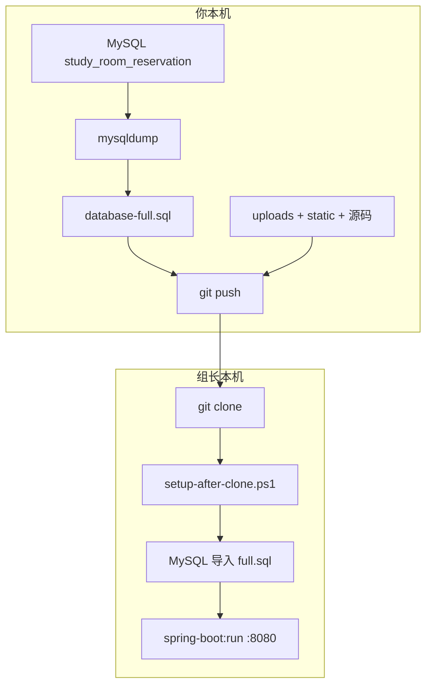

# 09 — 全量交付与组长一键验收

> **目标**：你把当前电脑上「代码 + 数据库全部数据 + 上传图片 + 已构建前端」一次性提交到 Git；组长 `git clone` 后**只运行一个脚本**，即可看到与你本地相同的界面和数据历史。

---

## 一、你需要上传（提交到 Git）的内容

### 1. 必交（组长验收核心）


| 类别          | 路径                                    | 说明                                 |
| ----------- | ------------------------------------- | ---------------------------------- |
| **数据库全量快照** | `docs/06-部署配置/database-full.sql`      | **最重要**：结构 + 你当前全部业务数据（预约、签到、信用分等） |
| 数据库结构       | `docs/06-部署配置/schema.sql`             | 仅表结构，课设常要                          |
| 数据库数据       | `docs/06-部署配置/data.sql`               | 仅 INSERT 数据                        |
| 建库脚本        | `docs/06-部署配置/init-shared-mysql.sql`  | 创建库名与用户（可选，一键脚本会用到）                |
| **一键验收脚本**  | `scripts/setup-after-clone.ps1`       | 组长 clone 后双击/运行这一条                 |
| 交付说明        | 本文档                                   | 你正在看的文件                            |
| 交付清单        | `docs/06-部署配置/delivery-manifest.json` | 导出时间、uploads 数量（自动生成）              |


### 2. 强烈建议一并提交


| 类别        | 路径                                        | 说明                       |
| --------- | ----------------------------------------- | ------------------------ |
| **已构建前端** | `src/main/resources/static/`              | 组长无需安装 Node 即可打开 8080 页面 |
| **上传文件**  | `uploads/material/`、`uploads/layout/`     | 注册材料、自习室平面图；**不提交则界面缺图** |
| 项目源码      | `src/`、`frontend/`、`pom.xml`、`mvnw.cmd` 等 | 正常代码提交                   |


### 3. 不要提交


| 路径                                 | 原因           |
| ---------------------------------- | ------------ |
| `application-local.properties`     | 含本机 MySQL 密码 |
| `application-shared.properties`    | 共用库密码        |
| `target/`、`frontend/node_modules/` | 可重新生成        |
| `backups/`                         | 本地临时备份       |


---

## 二、你（提交者）操作步骤 — 一口气做完

在 **PowerShell** 中进入项目根目录：

```powershell
cd D:\SchoolWorkPlace\Database\CSRRMupdate

# 1. 确保 MySQL 已启动，且本机库里有你要交给组长的那份数据
# 2. 一键：导出 SQL + 检查前端 + 生成交付清单
.\scripts\prepare-full-delivery.ps1

# 3. 按脚本末尾提示 git add / commit / push（示例）
git add docs/06-部署配置/schema.sql docs/06-部署配置/data.sql docs/06-部署配置/database-full.sql
git add docs/06-部署配置/delivery-manifest.json docs/06-部署配置/init-shared-mysql.sql
git add docs/01-使用指南/09-全量交付与组长一键验收.md
git add scripts/setup-after-clone.ps1 scripts/prepare-full-delivery.ps1
git add uploads/material uploads/layout uploads/common
git add src/main/resources/static
git commit -m "chore: 全量交付快照（数据库+上传文件+前端）"
git push
```

### `prepare-full-delivery.ps1` 做了什么？

1. 调用 `export-database-for-git.ps1`，用 **mysqldump** 从你本机 MySQL 的 `study_room_reservation` 库导出：
  - `schema.sql`
  - `data.sql`
  - `database-full.sql`（组长一键导入用这个）
2. 若缺少 `static/index.html`，自动 `npm run build`。
3. 生成 `delivery-manifest.json` 并打印 **git add 清单**。

> **以后每次测试产生新数据、要同步给组长前**，再执行一次 `prepare-full-delivery.ps1` 并 push 即可。

---

## 三、组长操作步骤 — 只需一个脚本

### 环境要求（组长电脑）


| 组件    | 版本         |
| ----- | ---------- |
| JDK   | 21+        |
| MySQL | 8.x（服务已启动） |
| Git   | 任意         |


**不需要** Node.js（前端已打包在 `static/`）。

### 一键命令

```powershell
cd <clone下来的路径>\CSRRMupdate
.\scripts\setup-after-clone.ps1
```

脚本会自动：

1. 检查 Java、MySQL 客户端、前端静态资源
2. 创建 `application-local.properties`（仅本机，不上传 Git）
3. 询问本机 MySQL **root 密码**（与你不一定相同，只用于导入到他本机）
4. 设置 `app.upload.dir` 指向项目内 `uploads/`
5. 设置 `app.demo.sync-accounts-on-startup=false`，**避免启动时改写字段覆盖 SQL 数据**
6. 导入 `database-full.sql` → 数据与提交时快照一致
7. 启动 `mvnw spring-boot:run`，约 25 秒后打开浏览器 `http://localhost:8080`

### 可选参数

```powershell
# 已知密码时免交互
.\scripts\setup-after-clone.ps1 -MySqlPassword 123456

# 只导入不启动
.\scripts\setup-after-clone.ps1 -SkipStart

# 已导入过，只启动
.\scripts\setup-after-clone.ps1 -SkipImport
```

---

## 四、为什么需要 `.sql` 文件？


| 问题                 | 说明                                                                |
| ------------------ | ----------------------------------------------------------------- |
| Git 不能传 MySQL 数据目录 | 数据库在 MySQL 自己的数据文件夹里，不能直接把文件夹提交到 Git                              |
| `.sql` 是标准交付格式     | 课设/组长要的就是「可导入的脚本」                                                 |
| 三个文件分工             | `schema.sql` 只看表结构；`data.sql` 只看数据；`database-full.sql` **一键还原整库** |


组长机器上的库名仍为：`study_room_reservation`。

---

## 五、数据与界面对齐清单

组长验收时，下列应与你提交时一致：


| 项目             | 如何保证                                          |
| -------------- | --------------------------------------------- |
| 预约 / 签到 / 信用记录 | `database-full.sql` 导入                        |
| 管理员、学生账号与密码    | SQL 内 `password_hash`（BCrypt）；默认演示账号仍可用，见下表   |
| 注册材料、平面图显示     | `uploads/` 已提交且 `app.upload.dir` 指向项目 uploads |
| 页面样式与功能        | `src/main/resources/static/` 已提交              |


### 演示账号（导入 SQL 后，密码未被改过时）


| 角色    | 账号             | 密码         |
| ----- | -------------- | ---------- |
| 学生    | `202301010101` | `123456`   |
| 管理员   | `admin`        | `admin123` |
| 超级管理员 | `superadmin`   | `super123` |


若组长曾用旧版启动且 `sync-accounts-on-startup=true`，可能把密码重置为上述默认值；**一键脚本已强制设为 false**。

---

## 六、常见问题

### Q1：组长导入报错 Access denied

本机 MySQL 密码与你不同，属正常。用 `-MySqlPassword` 或按脚本提示输入**组长自己的 root 密码**。

### Q2：界面有了，图片 404

未提交 `uploads/material`、`uploads/layout`，或 `app.upload.dir` 未指向项目 uploads。重新执行你的 `prepare-full-delivery.ps1` 并 `git add uploads/...`。

### Q3：数据条数和你不一样

你 push 之后又在本机测了新数据，但未再执行 `prepare-full-delivery.ps1`。请重新导出 SQL 再 push。

### Q4：想只要 SQL、不要自动启动

组长执行：`.\scripts\import-database-local.ps1 -UseFullDump`，再手动 `.\mvnw.cmd spring-boot:run`。

---

## 七、文件关系图




---

## 八、相关文档

- [数据库完整说明.md](../06-部署配置/数据库完整说明.md)
- [数据库文件说明.md](../06-部署配置/数据库文件说明.md)
- [05-启动流程与PowerShell命令.md](05-启动流程与PowerShell命令.md)

---

*提交前请务必执行 `.\scripts\prepare-full-delivery.ps1` 并 push 上述文件。*