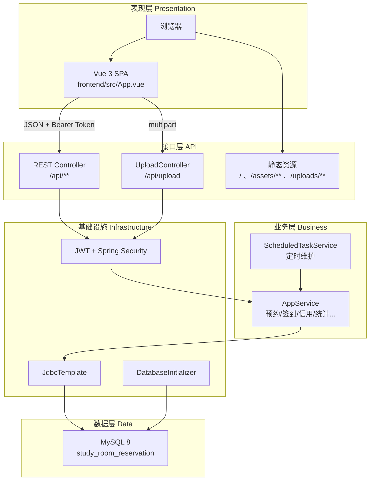

# 项目架构说明

> 校园自习室预约管理系统（CSRRMupdate V1.1）  
> 技术栈：Spring Boot 3.5 + Vue 3 + MySQL 8 + JWT

---

## 1. 系统定位

B/S 架构 Web 应用：浏览器访问，服务器处理业务，MySQL 持久化。


| 角色    | 能力                                  |
| ----- | ----------------------------------- |
| 学生    | 注册/登录、预约、二维码签到、暂离/返回、签退、信用、统计、公告、反馈 |
| 普通管理员 | 管理本人负责自习室的用户审核、座位、预约、签到、统计          |
| 超级管理员 | 全部数据 + 新增/删除自习室                     |


---

## 2. 逻辑分层




---

## 3. 后端模块职责


| 包/类                                | 职责                               |
| ---------------------------------- | -------------------------------- |
| `AppController`                    | 暴露全部业务 REST API（认证、预约、管理端等）      |
| `UploadController`                 | 文件上传，返回 `/uploads/...` URL       |
| `AppService`                       | 核心业务：冲突检测、信用分、暂离、统计、导出           |
| `DatabaseInitializer`              | 启动时 DDL 建表、种子数据、视图               |
| `ScheduledTaskService`             | 每分钟：未签到违约、自动签退、黑名单解除、暂离超时        |
| `SecurityConfig` + `JwtAuthFilter` | 路由鉴权、角色校验                        |
| `JwtService`                       | 签发/解析 JWT                        |
| `WebConfig`                        | 映射 `uploads/` 到 HTTP 路径          |
| `GlobalExceptionHandler`           | 统一错误 JSON                        |
| `ApiResponse`                      | 统一成功响应 `{ code, message, data }` |


---

## 4. 前端模块职责


| 文件               | 职责                                |
| ---------------- | --------------------------------- |
| `App.vue`        | 路由式单页：登录、学生 4 栏底导航、管理端侧栏/顶栏       |
| `qr.js`          | 将签到 token 编码为 QR SVG              |
| `styles.css`     | 移动端卡片 UI、管理端布局                    |
| `vite.config.js` | dev 时代理 `/api` → `localhost:8080` |


**构建链路**：`npm run build` → 输出到 `src/main/resources/static` → Spring Boot 一并托管。

---

## 5. 核心数据流

### 5.1 登录

```
浏览器 POST /api/auth/login { username, password }
  → AppService 校验 BCrypt 密码
  → JwtService 签发 token
  → 前端 localStorage 保存 token
  → 后续请求 Header: Authorization: Bearer <token>
```

### 5.2 预约（防冲突）

```
POST /api/reservations { roomId, seatId, date, startTime, endTime }
  → 校验审核状态、信用分、自习室 OPEN
  → 按 10 分钟切分 reservation_slot
  → uk_seat_slot(seat_id, slot_start) 唯一索引保证同事段仅一人成功
```

### 5.3 签到

```
学生 GET /api/checkin/qrcode → qrToken（60 秒有效）
管理员 POST /api/admin/checkin/scan { qrToken }
  → 解析 userId/reservationId/时间戳
  → reservation.status: PENDING → USING
  → 写入 checkin_record，可选加信用分
```

### 5.4 暂离

```
POST /api/reservations/{id}/temp-leave  → status: TEMP_LEAVE
POST /api/reservations/{id}/temp-return → status: USING
定时任务：暂离 > 30 分钟 → 自动签退 + 扣 30 分
```

---

## 6. 数据库实体（核心表）


| 表                                       | 用途           |
| --------------------------------------- | ------------ |
| `user_account` / `student_profile`      | 账号与学籍资料      |
| `admin_account`                         | 管理员          |
| `study_room` / `seat`                   | 自习室与座位网格     |
| `reservation` / `reservation_slot`      | 预约与时间片       |
| `checkin_record`                        | 签到记录         |
| `temp_leave`                            | 暂离（V1.1）     |
| `credit_log` / `blacklist_record`       | 信用与黑名单       |
| `announcement` / `notification_message` | 公告与通知        |
| `feedback_ticket`                       | 问题反馈         |
| `operation_log`                         | 管理操作日志（V1.1） |


视图：`v_room_daily_usage` — 当日自习室使用率统计。

---

## 7. 部署形态（本地开发）


| 组件    | 地址                                                        |
| ----- | --------------------------------------------------------- |
| 后端    | [http://localhost:8080](http://localhost:8080)            |
| 前端开发  | [http://localhost:5173（代理](http://localhost:5173（代理) API） |
| MySQL | localhost:3306 / `study_room_reservation`                 |


生产环境（V1.2 规划）：Nginx 反向代理 + Jar + MySQL。

---

## 8. 扩展方向（当前未实现）

- MyBatis 分层、Pinia + vue-router 拆分
- MySQL 触发器写操作日志
- jsQR 扫码 fallback、修改密码
- 完整集成测试与 Docker Compose

详见 [02-更新版说明](../04-版本记录/02-更新版说明.md)。