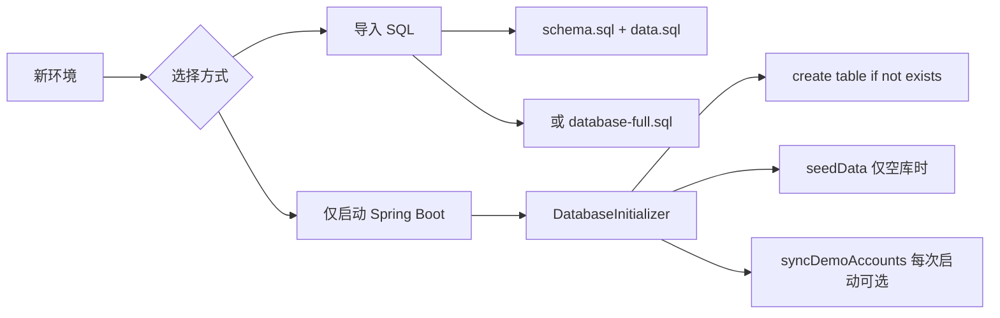
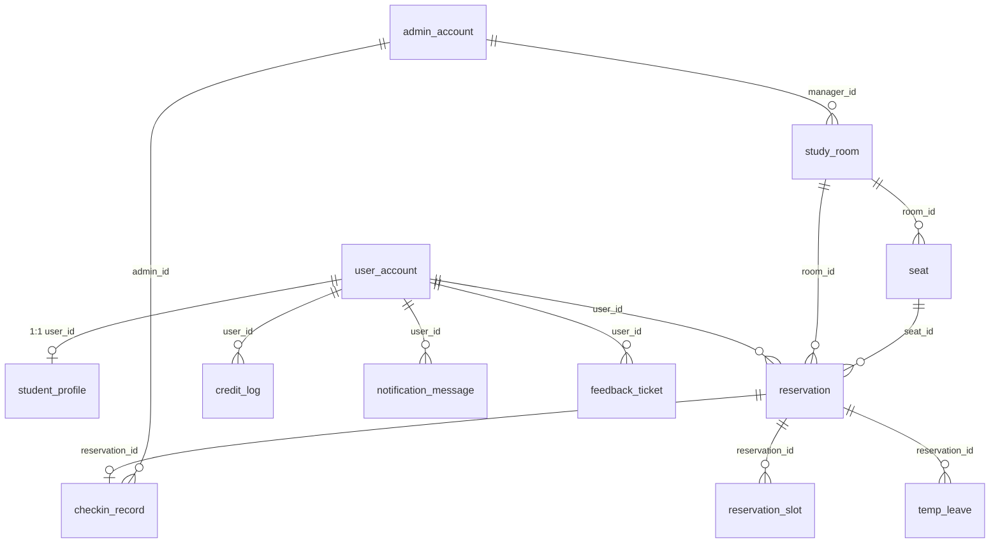

# 校园自习室预约管理系统 — 数据库完整说明

> **文档版本**：与仓库 `schema.sql`（2026-05-26 导出）对齐  
> **适用项目**：`CSRRMupdate`（Spring Boot 3 + MySQL 8 + JdbcTemplate）  
> **相关简版**：[数据库文件说明.md](数据库文件说明.md) · [课设数据库交付清单.md](课设数据库交付清单.md) · [07-多人共用一套系统与数据库.md](../01-使用指南/07-多人共用一套系统与数据库.md)

---

## 1. 总览：数据以什么形式存在？

本系统业务数据采用 **关系型数据库 MySQL 8** 存储，形态为：

| 层级 | 说明 |
|------|------|
| **数据库（Database）** | 逻辑库名 `study_room_reservation` |
| **表（Table）** | 15 张业务表 + 1 个统计视图 |
| **行（Row）** | 一条预约、一名学生、一条签到记录等 |
| **列（Column）** | 强类型字段（`bigint`、`varchar`、`date`、`time`、`datetime`、`text` 等） |

**不在 MySQL 里的内容**：

| 类型 | 存储位置 | 库中仅存 |
|------|----------|----------|
| 注册身份材料、自习室平面图 | 磁盘目录 `uploads/`（默认：项目根目录下） | URL 路径，如 `/uploads/material/xxx.jpg` |
| 登录会话 | JWT（客户端 localStorage） | 不存 Session 表 |

**字符集**：`utf8mb4`（支持中文、emoji）。  
**时区**：应用与 Jackson 使用 `Asia/Shanghai`；连接串带 `serverTimezone=Asia/Shanghai`。  
**访问方式**：Spring Boot 通过 **HikariCP 连接池** + **JdbcTemplate** 执行 SQL（未使用 MyBatis XML / JPA 实体映射）。

---

## 2. 物理位置与连接配置

### 2.1 MySQL 数据文件在哪？

由 MySQL 安装方式决定，常见路径示例：

- Windows 安装版：`C:\ProgramData\MySQL\MySQL Server 8.0\Data\study_room_reservation\`
- Docker 卷：由 `docker-compose` 挂载的 volume

应用通过 **JDBC URL** 连接，不直接读写上述目录。

### 2.2 默认连接参数

配置文件：`src/main/resources/application.properties`（可被本地配置覆盖）

| 配置项 | 默认值 / 说明 |
|--------|----------------|
| `spring.datasource.url` | `jdbc:mysql://localhost:3306/study_room_reservation?createDatabaseIfNotExist=true&useUnicode=true&characterEncoding=utf8&serverTimezone=Asia/Shanghai&allowPublicKeyRetrieval=true&useSSL=false` |
| `spring.datasource.username` | `root`（可用环境变量 `DB_USERNAME`） |
| `spring.datasource.password` | 空（可用 `DB_PASSWORD`） |
| `spring.datasource.driver-class-name` | `com.mysql.cj.jdbc.Driver` |
| 连接池 | HikariCP，`maximum-pool-size` 默认 15 |

**本地开发**：复制 `application-local.properties.example` → `application-local.properties`，填写密码（该文件在 `.gitignore`，不提交）。

**多人共用库**：使用 `application-shared.properties`（见 [07-多人共用](../01-使用指南/07-多人共用一套系统与数据库.md)），库名仍为 `study_room_reservation`，用户常为 `study`。

**环境变量覆盖示例**：

```powershell
$env:DB_URL="jdbc:mysql://192.168.1.100:3306/study_room_reservation?useUnicode=true&characterEncoding=utf8&serverTimezone=Asia/Shanghai"
$env:DB_USERNAME="study"
$env:DB_PASSWORD="你的密码"
.\mvnw.cmd spring-boot:run
```

### 2.3 上传文件目录

| 配置项 | 默认 |
|--------|------|
| `app.upload.dir` | `${user.dir}/uploads`（项目启动目录下的 `uploads` 文件夹） |

子目录分类：`material`（注册材料）、`layout`（座位分布图）、`common`。  
HTTP 访问路径：`http://主机:8080/uploads/...`（由 `WebConfig` 映射）。

---

## 3. 仓库内 SQL 与脚本文件

| 文件 / 脚本 | 路径 | 用途 |
|-------------|------|------|
| 建库与用户 | `docs/06-部署配置/init-shared-mysql.sql` | 创建库 `study_room_reservation`、用户 `study` |
| **仅结构** | `docs/06-部署配置/schema.sql` | 表、索引、视图（`mysqldump --no-data`） |
| **仅数据** | `docs/06-部署配置/data.sql` | INSERT 演示数据 |
| **结构+数据** | `docs/06-部署配置/database-full.sql` | 一键导入 / 打包交作业 |
| 导出脚本 | `scripts/export-database-for-git.ps1` | 从本机 MySQL 刷新上述三个 SQL |
| 导入脚本 | `scripts/import-database-local.ps1` | clone 后恢复本机库 |
| 连接测试 | `scripts/test-db-connection.ps1` | 验证账号能否连库 |
| Docker 共用库 | `scripts/setup-shared-mysql-docker.ps1` | 组内共用 MySQL 容器 |

**不要提交 Git**：`application-local.properties`、`application-shared.properties`、`backups/` 下带时间戳的备份。

---

## 4. 建库与灌数据的两种方式



| 方式 | 何时使用 | 说明 |
|------|----------|------|
| **导入 SQL** | 课设提交、与组长库一致、验收审表结构 | 推荐 `.\scripts\import-database-local.ps1` |
| **自动初始化** | 日常开发、空库首次启动 | `DatabaseInitializer.java` 在 `CommandLineRunner` 中执行 |

注意：

- `spring.sql.init.mode=never`，**不会**自动执行 `resources` 下的 `schema.sql`。
- 若库中已有管理员记录，`seedData()` **不会**重复插入演示数据。
- `app.demo.sync-accounts-on-startup=true`（默认）时，每次启动会把演示账号密码恢复为文档默认值。

---

## 5. 逻辑结构：表清单与关系

共 **15 张表**、**1 个视图**。库设计**未使用外键约束**（由应用层保证引用一致性），通过 `*_id` 字段逻辑关联。

### 5.1 表清单

| 表名 | 中文含义 | 核心用途 |
|------|----------|----------|
| `user_account` | 登录账号 | 学生/统一认证入口；`username` 为学生学号 |
| `student_profile` | 学生档案 | 姓名、学院、审核状态、信用分 |
| `admin_account` | 管理员 | 普通管理员 / 超级管理员 |
| `study_room` | 自习室 | 开放时间、负责人、行列规模 |
| `seat` | 座位/网格单元 | 座位号、电源/静音等属性 |
| `reservation` | 预约主表 | 某学生某日某时段占某座 |
| `reservation_slot` | 预约时段占用 | 按 10 分钟切片防重复占座 |
| `checkin_record` | 签到记录 | 管理员扫码签到，一预约一条 |
| `temp_leave` | 暂离 | 使用中暂时离开 |
| `credit_log` | 信用流水 | 加减分历史 |
| `blacklist_record` | 黑名单 | 限制预约（可释放） |
| `announcement` | 公告 | 系统/规则通知 |
| `notification_message` | 站内消息 | 学生端消息中心 |
| `feedback_ticket` | 反馈工单 | 座位报修、建议等 |
| `operation_log` | 操作日志 | 管理员关键操作审计 |

### 5.2 视图

| 视图名 | 说明 |
|--------|------|
| `v_room_daily_usage` | 按**当天**统计各自习室预约数、使用数、使用率（管理端统计可参考） |

### 5.3 主要实体关系（逻辑 ER）



---

## 6. 各表字段摘要

以下与 `schema.sql` 一致；详细 DDL 以 SQL 文件为准。

### 6.1 `user_account` — 账号

| 字段 | 类型 | 说明 |
|------|------|------|
| `username` | varchar(30) | 学生登录名（学号），唯一 |
| `password_hash` | varchar(100) | BCrypt 哈希，**非明文** |
| `role` | varchar(20) | `STUDENT` |
| `status` | varchar(20) | `NORMAL` / `DISABLED` / `PENDING`（注册待审） |

### 6.2 `student_profile` — 学生档案

| 字段 | 说明 |
|------|------|
| `student_no` | 学号，唯一 |
| `audit_status` | `PENDING` / `APPROVED` / `REJECTED` |
| `credit_score` | 信用积分，默认 300，上限 500（业务常量） |
| `material_url` | 注册材料路径 |

### 6.3 `admin_account` — 管理员

| 字段 | 说明 |
|------|------|
| `account` | 登录账号，唯一 |
| `role` | `ADMIN` / `SUPER_ADMIN` |
| `status` | `NORMAL` / `DISABLED` |

### 6.4 `study_room` — 自习室

| 字段 | 说明 |
|------|------|
| `room_code` | 房间编码，唯一 |
| `open_time` / `close_time` | 每日可预约时段边界 |
| `status` | `OPEN` / `CLOSED` / `MAINTENANCE`（库中亦可能出现 `MAINTAINING`，与初始化种子一致） |
| `manager_id` | 负责管理员 `admin_account.id` |
| `row_count` / `col_count` | 座位网格规模 |
| `layout_image_url` | 平面图 URL |

### 6.5 `seat` — 座位

| 字段 | 说明 |
|------|------|
| `seat_no` | 座位编号，同房间唯一 `(room_id, seat_no)` |
| `is_seat` | 1=可预约座位，0=过道等非座位格 |
| `cell_category` | `SEAT` / `NON_SEAT` 等 |
| `status` | `NORMAL` / `DISABLED` / `DAMAGED` |
| `has_power` / `near_window` / `quiet_zone` / `hot_seat` | 筛选属性（0/1） |

### 6.6 `reservation` — 预约

| 字段 | 说明 |
|------|------|
| `reservation_no` | 业务单号，唯一 |
| `reserve_date` | 预约日期 |
| `start_time` / `end_time` | 时段 |
| `status` | 见 [§7 状态枚举](#7-状态与业务常量) |
| `sign_in_time` / `sign_out_time` | 实际到离馆时间 |
| `actual_minutes` | 实际学习分钟数 |
| `cancel_reason` | 取消/违约原因 |

**索引要点**：`(user_id, reserve_date)`、`(room_id, reserve_date)`、`(seat_id, reserve_date)`、`status`。

### 6.7 `reservation_slot` — 时段占用

将预约按 **10 分钟** 切分为多条记录，唯一约束 `(seat_id, slot_start)`，防止同座同时段重复预约。

### 6.8 `checkin_record` — 签到

| 字段 | 说明 |
|------|------|
| `reservation_id` | 唯一，一预约最多一条签到记录 |
| `admin_id` | 操作签到的管理员 |
| `checkin_method` | 如扫码/学号 |
| `result` | `ON_TIME` / `LATE` / `INVALID` 等 |

### 6.9 其他表（简述）

| 表 | 要点 |
|----|------|
| `credit_log` | `change_type` + `change_value` + `before_score` / `after_score` |
| `temp_leave` | `leave_status`：`ACTIVE` 等；默认最长暂离 30 分钟 |
| `blacklist_record` | `status`：`ACTIVE` / `RELEASED` |
| `announcement` | `scope`：`GLOBAL` / 指定房间；`pinned` 置顶 |
| `notification_message` | `read_flag` 0/1 |
| `feedback_ticket` | `severity`：`LOW`~`CRITICAL`；`status` 处理流 |
| `operation_log` | 管理员操作审计 |

---

## 7. 状态与业务常量

### 7.1 预约 `reservation.status`

| 值 | 含义 |
|----|------|
| `PENDING` | 待签到 |
| `USING` | 使用中 |
| `TEMP_LEAVE` | 暂离中 |
| `COMPLETED` | 已签退完成 |
| `CANCELLED` | 学生取消 |
| `VIOLATED` | 违约（如超时未签到） |
| `AUTO_CANCELLED` | 系统自动取消 |
| `AUTO_CHECKOUT` | 自动签退 |

### 7.2 信用相关（`AppService` 常量）

| 常量 | 值 | 说明 |
|------|-----|------|
| 信用上限 | 500 | `CREDIT_SCORE_MAX` |
| 取消预约扣分 | -50 | `CREDIT_CANCEL_PENALTY` |
| 签到窗口 | 开始前 15 分钟 ~ 开始后 15 分钟 | `CHECKIN_EARLY_MINUTES` / `CHECKIN_LATE_MINUTES` |

### 7.3 学生审核 `audit_status`

`PENDING` → `APPROVED` / `REJECTED`

---

## 8. 演示账号（导入 `data.sql` 或空库种子后）

| 角色 | 账号 | 密码 | 说明 |
|------|------|------|------|
| 学生 | `202301010101` | `123456` | 张三，已审核 |
| 学生 | `202301010102` | `123456` | 李四 |
| 学生 | `202301010199` | `123456` | 待审核示例 |
| 管理员 | `admin` | `admin123` | 普通管理员 |
| 超级管理员 | `superadmin` | `super123` | 超级管理员 |

密码在库中为 **BCrypt**；`data.sql` 中为哈希值，不可直接当明文使用。

---

## 9. 如何导出数据

### 9.1 整库导出（备份 / 课设交 SQL）— 推荐

**项目脚本**（自动读取 `application-local.properties` 中的密码）：

```powershell
cd D:\SchoolWorkPlace\Database\CSRRMupdate
.\scripts\export-database-for-git.ps1
# 或指定账号
.\scripts\export-database-for-git.ps1 -User root -Password 你的密码
```

输出到 `docs/06-部署配置/`：

- `schema.sql` — 仅结构  
- `data.sql` — 仅数据  
- `database-full.sql` — 完整库  

**手动 mysqldump**：

```powershell
# 完整库
mysqldump -u root -p --set-charset --default-character-set=utf8mb4 study_room_reservation > backup-20260526.sql

# 仅结构
mysqldump -u root -p --no-data study_room_reservation > schema-only.sql

# 仅数据
mysqldump -u root -p --no-create-info --complete-insert study_room_reservation > data-only.sql
```

### 9.2 管理端业务导出（CSV，非整库）

| 功能 | 入口 | API | 格式 |
|------|------|-----|------|
| 学生用户 | 管理端 → 用户管理 → 导出 CSV | `GET /api/admin/users/export` | UTF-8 CSV（含 BOM） |
| 统计报表 | 管理端 → 统计 → 导出报表 | `GET /api/admin/statistics/export?period=&rangeMode=&roomId=` | UTF-8 CSV |

适合交**业务报表**，不能替代数据库备份。

### 9.3 图形化工具

使用 **MySQL Workbench**、**Navicat**、**DBeaver** 等：

- 整库备份 / 还原  
- 单表导出 CSV、Excel  
- 自定义 `SELECT` 结果导出  

### 9.4 上传文件备份

复制整个目录（与 `app.upload.dir` 一致）：

```powershell
# 示例：打包 uploads
Compress-Archive -Path D:\SchoolWorkPlace\Database\CSRRMupdate\uploads -DestinationPath uploads-backup.zip
```

---

## 10. 如何导入 / 恢复

### 10.1 一键导入（推荐）

```powershell
cd D:\SchoolWorkPlace\Database\CSRRMupdate
.\scripts\import-database-local.ps1
# 或使用合一文件
.\scripts\import-database-local.ps1 -UseFullDump
```

### 10.2 手动导入

```powershell
mysql -u root -p < docs\06-部署配置\init-shared-mysql.sql
mysql -u root -p study_room_reservation < docs\06-部署配置\schema.sql
mysql -u root -p study_room_reservation < docs\06-部署配置\data.sql
```

### 10.3 仅启动应用（空库自动建表）

```powershell
.\mvnw.cmd spring-boot:run
```

确保 JDBC URL 中 `createDatabaseIfNotExist=true` 或已手动建库。

---

## 11. 测试环境说明（H2）

单元 / 集成测试使用 **内存库 H2**（`application-test.properties`）：

```
jdbc:h2:mem:study_room_test;MODE=MySQL;...
```

| 对比项 | 生产 / 开发 MySQL | 测试 H2 |
|--------|-------------------|---------|
| 数据持久化 | 持久 | 进程结束即消失 |
| 部分 SQL | MySQL 函数 `date_format`、`if()` 等 | 部分统计 SQL 在测试中记为「预期语法差异」 |
| 用途 | 真实部署 | `mvn test` |

**课设答辩与导出请以 MySQL 为准。**

---

## 12. 应用层数据访问说明

| 项目 | 选择 |
|------|------|
| ORM | 无；`JdbcTemplate` + 手写 SQL |
| 建表来源 | `DatabaseInitializer.createTables()` 与 `schema.sql` 应保持语义一致 |
| 迁移 | `migrateReservationSlotSchema()` 等少量启动时补丁 |
| 事务 | 关键业务在 `AppService` 方法上使用 `@Transactional` |

主要读写集中在：`AppService.java`、`DatabaseInitializer.java`、`ScheduledTaskService.java`（定时违约、自动签退等）。

---

## 13. 安全与维护建议

1. **不要**将 `application-local.properties`、数据库密码、`backups/*.sql` 提交到公开仓库。  
2. 共用库部署后修改默认密码 `csrrm_shared_123`。  
3. 定期执行 `export-database-for-git.ps1` 或 `mysqldump`，保留带日期的备份文件到 `backups/`（本地即可，勿提交）。  
4. 恢复前先在测试库验证 SQL，避免覆盖生产误操作。  
5. 上传目录与数据库需**一起备份**，否则材料链接会失效。  

---

## 14. 常见问题

| 问题 | 处理 |
|------|------|
| 启动报 Access denied | 检查 `application-local.properties` 用户名密码 |
| 表不存在 | 导入 `schema.sql` 或清空库后重启让 `DatabaseInitializer` 建表 |
| 演示账号登不上 | 确认 `app.demo.sync-accounts-on-startup=true` 或重新导入 `data.sql` |
| 统计年报报错 | 需 MySQL 8；确保 `ONLY_FULL_GROUP_BY` 下趋势 SQL 已更新（见项目最新代码） |
| clone 后无数据 | 执行 `import-database-local.ps1`，不要只跑前端 |

---

## 15. 文档维护

表结构变更后请按顺序执行：

1. 在 MySQL 中完成变更并验证应用。  
2. `.\scripts\export-database-for-git.ps1`  
3. 更新本文档「表清单 / 字段 / 状态枚举」相关章节。  
4. 提交 `schema.sql`、`data.sql`、`database-full.sql` 及本文档。

---

*最后整理：2026-05-26*
