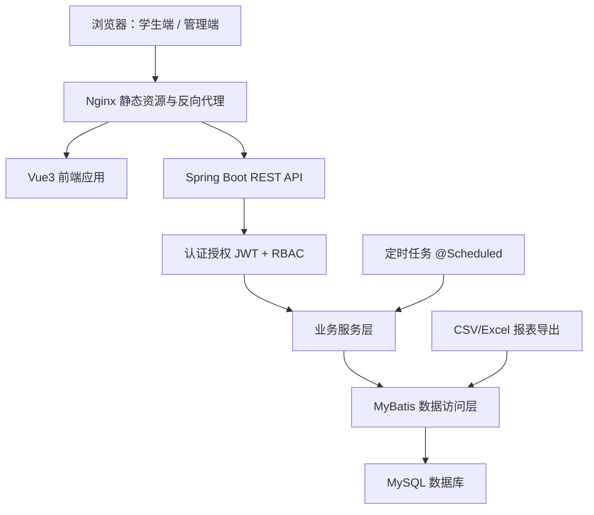
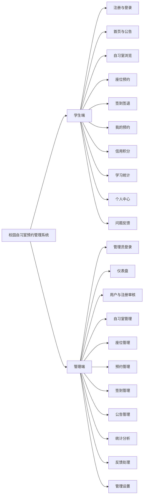
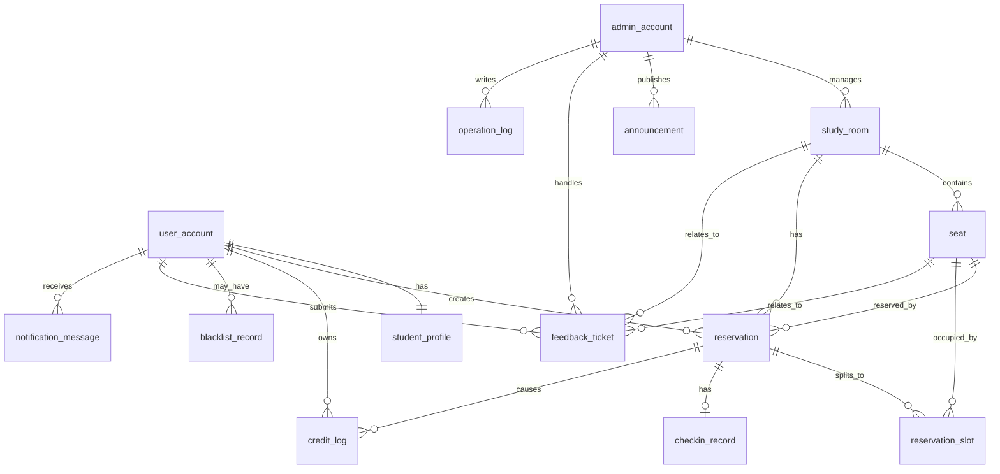
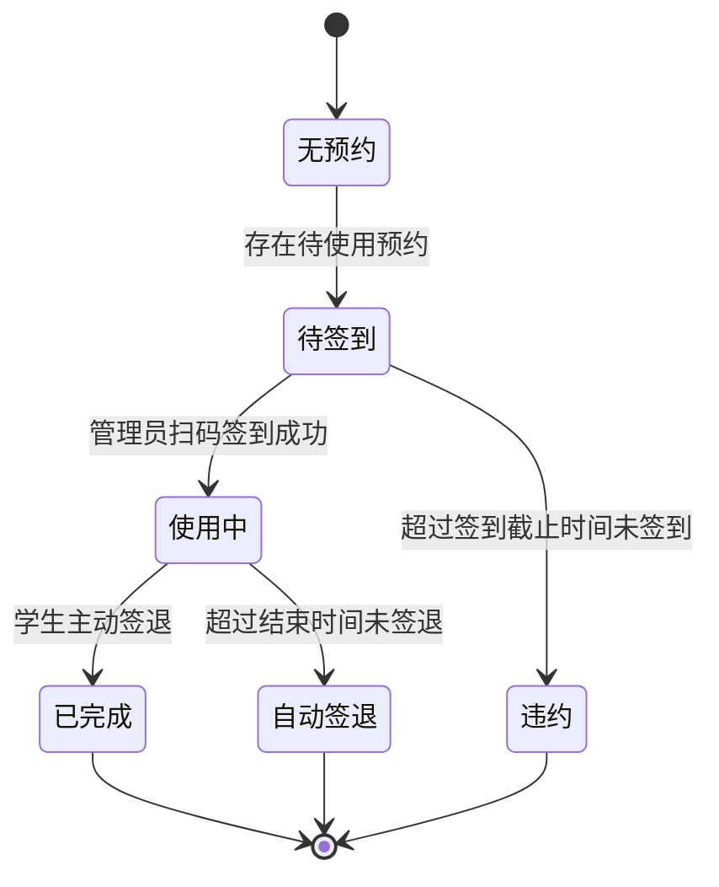

# 校园自习室预约管理系统概要设计与详细设计

版本：V1.0  
依据文档：《校园自习室预约管理系统需求分析文档（第三版）》、《原型设计.html》、《2026数据库课程设计任务书》、《数据库课程设计报告模板》  
适用阶段：应用系统设计阶段  
目标：用于指导后续数据库建表、前后端编码、接口联调、测试和部署演示。

## 1 引言

### 1.1 编写目的

本文档在需求分析文档的基础上，完成校园自习室预约管理系统的概要设计和详细设计。文档重点说明系统整体架构、功能模块划分、数据库结构、接口设计、页面交互逻辑、核心算法、异常处理和部署使用方案，使开发人员可以按照本文档直接开展编码实现。

### 1.2 系统定位

校园自习室预约管理系统是一个通过浏览器访问的 B/S 架构 Web 应用，面向学生、普通管理员和超级管理员三类用户。系统通过在线预约、扫码签到、签退统计、信用积分、公告通知、问题反馈和统计分析，提高自习室座位资源利用率，减少占座、找座和管理困难等问题。

### 1.3 术语说明

| 术语 | 说明 |
|---|---|
| 自习室 | 校内图书馆或教学楼中可供学生学习的公共空间 |
| 座位 | 自习室中的最小预约单位 |
| 单元格 | 自习室布局中的一个格子，可为座位类或非座位类，如过道、门、讲台 |
| 预约 | 学生提前选择某日期、时间段、自习室和座位的行为 |
| 签到 | 学生到达后出示二维码，由管理员扫码确认到达 |
| 签退 | 学生结束使用后主动点击签退或系统自动签退 |
| 信用积分 | 衡量学生预约守约情况的分值，初始 300 分，最高 500 分 |
| 黑名单 | 信用积分过低后临时禁止预约的状态 |
| 普通管理员 | 只能管理自己负责的自习室 |
| 超级管理员 | 可以管理所有自习室、管理员和全局数据 |

## 2 总体概要设计

### 2.1 系统目标

1. 学生可以通过浏览器完成注册、登录、自习室浏览、座位预约、签到签退、预约管理、信用查询、学习统计、公告查看和问题反馈。
2. 管理员可以通过浏览器完成注册审核、用户管理、自习室管理、座位管理、预约管理、签到管理、公告管理、统计分析和反馈处理。
3. 系统支持 30-50 人同时在线使用，普通页面 3 秒内响应，预约和签到等关键操作 2 秒内响应。
4. 系统通过数据库约束和事务控制避免同一座位同一时间段重复预约。
5. 系统可以本地部署，也可以在局域网中通过服务器 IP 供多台设备浏览器访问。

### 2.2 技术架构

系统采用前后端分离的三层 B/S 架构。

| 层次 | 技术选型 | 设计说明 |
|---|---|---|
| 表现层 | Vue 3、Vite、Element Plus、CSS Grid、ECharts | 实现学生端和管理端页面，座位图采用 CSS Grid，统计图采用 ECharts |
| 接口层 | Spring Boot REST Controller | 对外提供 JSON API，统一响应格式，统一异常处理 |
| 业务层 | Spring Boot Service | 实现预约、签到、签退、信用积分、统计分析等业务规则 |
| 持久层 | MyBatis-Plus 或 MyBatis | 完成数据库 CRUD、分页、复杂查询和报表 SQL |
| 数据库 | MySQL 8.4.6 | 存储用户、自习室、座位、预约、信用、公告、反馈等数据 |
| 鉴权 | JWT、Spring Security、RBAC | 学生、普通管理员、超级管理员分角色授权 |
| 部署 | Nginx、Spring Boot Jar、MySQL | Nginx 部署前端并反向代理后端接口 |

### 2.3 系统整体结构



### 2.4 功能模块结构



### 2.5 用户角色与权限

| 角色 | 权限说明 |
|---|---|
| 游客 | 只能访问登录页、注册弹窗、系统说明 |
| 待审核学生 | 可登录时应提示资料待审核；不能预约、签到、反馈 |
| 正常学生 | 可预约、取消未开始预约、查看公告、出示二维码、签退、查看学习统计、提交反馈 |
| 黑名单学生 | 可登录、查看个人信息和历史预约，不能创建新预约 |
| 普通管理员 | 只能管理本人负责的自习室、座位、预约、签到、反馈和统计数据；不能新增和删除自习室 |
| 超级管理员 | 管理所有数据；可以新增、删除自习室；可以配置负责人和管理员账号 |

## 3 数据库概要设计

### 3.1 数据库设计原则

1. 以需求文档的数据字典为来源，所有数据库实体和字段均能对应用户界面或业务流程。
2. 核心实体包括用户、学生资料、管理员、自习室、座位、预约、预约时间片、签到记录、信用记录、黑名单、公告、通知、反馈、操作日志。
3. 学号目前需求为 12 位数字，但考虑未来扩展，数据库字段使用 `varchar(20)`。
4. 自习室座位布局支持行列、座位属性和非座位单元格，满足原型中的单元格编辑、批量设置和布局图上传。
5. 预约冲突通过事务、时间片表和唯一索引共同控制。
6. 报表通过视图、聚合 SQL 或存储过程计算，不重复保存大量统计结果。
7. 所有表使用 `utf8mb4` 字符集，时间字段统一使用 `datetime`，系统时区为 `Asia/Shanghai`。

### 3.2 实体关系图



## 4 数据表详细设计

说明：本节先按需求文档数据字典风格列出每张表的数据项、说明、数据类型、取值范围/长度和示例，再给出物理表结构要点，便于同时满足课程文档和编码实现需要。

### 4.1 用户账号表 user_account

数据组成：用户账号信息 = 用户ID + 登录账号 + 密码 + 角色 + 账号状态 + 最后登录时间 + 创建时间 + 更新时间。

| 数据项 | 说明 | 数据类型 | 取值范围/长度 | 示例 |
|---|---|---|---|---|
| 用户ID | 系统内部唯一标识 | 整数 | bigint，自增 | 10001 |
| 登录账号 | 学生为学号，管理员为管理员账号 | 字符串 | 不超过 30 字符 | 202301010101 |
| 密码 | 登录密码，不明文保存 | 字符串 | BCrypt 后 60-100 字符 | `$2a$10$...` |
| 用户角色 | 账号角色 | 枚举 | STUDENT / ADMIN / SUPER_ADMIN | STUDENT |
| 账号状态 | 当前可用状态 | 枚举 | PENDING / NORMAL / DISABLED / BLACKLIST | NORMAL |
| 最后登录时间 | 最近一次登录时间 | 日期时间 | YYYY-MM-DD HH:MM:SS | 2026-04-20 08:30:00 |
| 创建时间 | 账号创建时间 | 日期时间 | YYYY-MM-DD HH:MM:SS | 2026-04-01 09:00:00 |
| 更新时间 | 最近修改时间 | 日期时间 | YYYY-MM-DD HH:MM:SS | 2026-04-20 10:00:00 |

物理设计：

| 字段名 | 类型 | 约束 | 说明 |
|---|---|---|---|
| id | bigint | PK, auto_increment | 用户ID |
| username | varchar(30) | not null, unique | 登录账号 |
| password_hash | varchar(100) | not null | BCrypt 密码 |
| role | varchar(20) | not null | 角色 |
| status | varchar(20) | not null | 状态 |
| last_login_at | datetime | null | 最后登录 |
| created_at | datetime | not null | 创建时间 |
| updated_at | datetime | not null | 更新时间 |

索引：`uk_user_username(username)`、`idx_user_role_status(role, status)`。

### 4.2 学生资料表 student_profile

数据组成：学生资料 = 学号 + 姓名 + 性别 + 学院 + 专业 + 年级 + 手机号码 + 邮箱 + 身份材料 + 审核状态 + 信用积分。

| 数据项 | 说明 | 数据类型 | 取值范围/长度 | 示例 |
|---|---|---|---|---|
| 学生资料ID | 学生资料唯一标识 | 整数 | bigint，自增 | 20001 |
| 用户ID | 关联 user_account | 整数 | bigint | 10001 |
| 学号 | 学生唯一标识 | 字符串 | 10-20 位，当前 12 位数字 | 202301010101 |
| 姓名 | 学生姓名 | 字符串 | 2-10 个汉字或 2-50 字符 | 张三 |
| 性别 | 学生性别 | 枚举 | 男 / 女 / 保密 | 男 |
| 学院 | 所属学院 | 字符串 | 不超过 50 字符 | 计算机学院 |
| 专业 | 所属专业 | 字符串 | 不超过 50 字符 | 软件工程 |
| 年级 | 入学年份或年级 | 字符串 | 4-10 字符 | 2023 |
| 手机号码 | 联系电话 | 字符串 | 11-20 字符 | 13800138000 |
| 邮箱 | 电子邮箱 | 字符串 | 不超过 100 字符 | zhangsan@example.edu.cn |
| 身份材料地址 | 上传的身份证明材料 | 字符串 | 不超过 255 字符 | /uploads/material/10001.jpg |
| 注册审核状态 | 管理员审核结果 | 枚举 | PENDING / APPROVED / REJECTED | APPROVED |
| 审核备注 | 审核不通过原因 | 字符串 | 不超过 255 字符 | 学号信息不清晰 |
| 信用积分 | 当前信用分 | 整数 | 0-500，初始 300 | 300 |
| 注册时间 | 提交注册时间 | 日期时间 | YYYY-MM-DD HH:MM:SS | 2026-04-01 09:00:00 |

物理设计：

| 字段名 | 类型 | 约束 | 说明 |
|---|---|---|---|
| id | bigint | PK, auto_increment | 学生资料ID |
| user_id | bigint | FK, not null, unique | 关联用户账号 |
| student_no | varchar(20) | not null, unique | 学号 |
| name | varchar(50) | not null | 姓名 |
| gender | varchar(10) | not null | 性别 |
| college | varchar(50) | not null | 学院 |
| major | varchar(50) | not null | 专业 |
| grade | varchar(10) | not null | 年级 |
| phone | varchar(20) | not null | 手机 |
| email | varchar(100) | not null | 邮箱 |
| material_url | varchar(255) | null | 身份材料 |
| audit_status | varchar(20) | not null | 审核状态 |
| audit_remark | varchar(255) | null | 审核备注 |
| credit_score | int | not null, default 300 | 信用积分 |
| created_at | datetime | not null | 注册时间 |
| updated_at | datetime | not null | 更新时间 |

索引：`uk_student_no(student_no)`、`idx_student_audit_status(audit_status)`、`idx_student_college_major(college, major)`。

### 4.3 管理员表 admin_account

数据组成：管理员信息 = 管理员账号 + 密码 + 姓名 + 角色 + 负责范围 + 手机号码 + 账号状态。

| 数据项 | 说明 | 数据类型 | 取值范围/长度 | 示例 |
|---|---|---|---|---|
| 管理员ID | 管理员唯一标识 | 整数 | bigint，自增 | 30001 |
| 管理员账号 | 登录账号 | 字符串 | 不超过 30 字符 | zhang_admin |
| 密码 | 登录密码 | 字符串 | BCrypt 后 60-100 字符 | `$2a$10$...` |
| 姓名 | 管理员姓名 | 字符串 | 2-20 字符 | 张老师 |
| 角色 | 管理员角色 | 枚举 | NORMAL_ADMIN / SUPER_ADMIN | NORMAL_ADMIN |
| 联系电话 | 管理员手机号 | 字符串 | 11-20 字符 | 13800138000 |
| 账号状态 | 当前状态 | 枚举 | NORMAL / DISABLED | NORMAL |
| 创建时间 | 账号创建时间 | 日期时间 | YYYY-MM-DD HH:MM:SS | 2026-04-01 09:00:00 |

物理设计：

| 字段名 | 类型 | 约束 | 说明 |
|---|---|---|---|
| id | bigint | PK, auto_increment | 管理员ID |
| account | varchar(30) | not null, unique | 管理员账号 |
| password_hash | varchar(100) | not null | 密码 |
| name | varchar(20) | not null | 姓名 |
| role | varchar(20) | not null | 角色 |
| phone | varchar(20) | null | 手机 |
| status | varchar(20) | not null | 状态 |
| created_at | datetime | not null | 创建时间 |
| updated_at | datetime | not null | 更新时间 |

索引：`uk_admin_account(account)`、`idx_admin_role(role)`。

### 4.4 自习室表 study_room

数据组成：自习室信息 = 自习室编号 + 自习室名称 + 所在位置 + 楼层 + 开放时间 + 当前状态 + 负责人 + 行数 + 列数 + 总座位数 + 设施配置 + 布局图。

| 数据项 | 说明 | 数据类型 | 取值范围/长度 | 示例 |
|---|---|---|---|---|
| 自习室ID | 自习室唯一标识 | 整数 | bigint，自增 | 40001 |
| 自习室编号 | 面向系统的编号 | 字符串 | 不超过 20 字符 | LIB-01-A |
| 自习室名称 | 页面显示名称 | 字符串 | 不超过 50 字符 | 图书馆一楼A区 |
| 所在位置 | 具体位置说明 | 字符串 | 不超过 100 字符 | 图书馆1楼东侧 |
| 楼层 | 楼层信息 | 字符串 | 不超过 20 字符 | 1楼 |
| 开放开始时间 | 每日开始开放时间 | 时间 | HH:MM:SS | 07:00:00 |
| 开放结束时间 | 每日结束开放时间 | 时间 | HH:MM:SS | 22:30:00 |
| 自习室状态 | 当前开放情况 | 枚举 | OPEN / MAINTAINING / CLOSED | OPEN |
| 负责人 | 普通管理员或超级管理员 | 整数 | bigint | 30001 |
| 布局行数 | 座位图行数 | 整数 | 1-20 | 4 |
| 布局列数 | 座位图列数 | 整数 | 1-20 | 6 |
| 总单元格数 | 行数乘列数 | 整数 | 1-400 | 24 |
| 座位数量 | 座位类单元格数量 | 整数 | 1-500 | 20 |
| 设施配置 | 空调、WiFi等 | 字符串 | 不超过 200 字符 | 空调,WiFi,饮水机 |
| 布局图片地址 | 自习室平面图 | 字符串 | 不超过 255 字符 | /uploads/layout/lib1a.png |
| 创建时间 | 数据创建时间 | 日期时间 | YYYY-MM-DD HH:MM:SS | 2026-04-01 09:00:00 |

物理设计：

| 字段名 | 类型 | 约束 | 说明 |
|---|---|---|---|
| id | bigint | PK, auto_increment | 自习室ID |
| room_code | varchar(20) | not null, unique | 自习室编号 |
| name | varchar(50) | not null | 名称 |
| location | varchar(100) | not null | 位置 |
| floor | varchar(20) | not null | 楼层 |
| open_time | time | not null | 开放开始 |
| close_time | time | not null | 开放结束 |
| status | varchar(20) | not null | 状态 |
| manager_id | bigint | FK, not null | 负责人 |
| row_count | int | not null | 行数 |
| col_count | int | not null | 列数 |
| cell_count | int | not null | 总单元格数 |
| seat_count | int | not null | 座位数量 |
| facilities | varchar(200) | null | 设施，逗号分隔 |
| layout_image_url | varchar(255) | null | 布局图 |
| created_at | datetime | not null | 创建时间 |
| updated_at | datetime | not null | 更新时间 |

索引：`uk_room_code(room_code)`、`idx_room_manager(manager_id)`、`idx_room_status(status)`。

### 4.5 座位表 seat

数据组成：座位信息 = 所属自习室 + 座位号 + 所在行列 + 是否座位 + 座位类型 + 电源 + 靠窗 + 静音区 + 热门 + 当前状态。

| 数据项 | 说明 | 数据类型 | 取值范围/长度 | 示例 |
|---|---|---|---|---|
| 座位ID | 座位唯一标识 | 整数 | bigint，自增 | 50001 |
| 自习室ID | 所属自习室 | 整数 | bigint | 40001 |
| 座位号 | 页面显示座位编号 | 字符串 | 不超过 20 字符 | A-01 |
| 行号 | 布局中第几行 | 整数 | 1-20 | 1 |
| 列号 | 布局中第几列 | 整数 | 1-20 | 1 |
| 是否座位单元格 | 区分座位与过道等 | 布尔 | 0/1 | 1 |
| 单元格分类 | 顶层分类 | 枚举 | SEAT / NON_SEAT | SEAT |
| 座位类型 | 座位子类 | 枚举或字符串 | 普通/静音/电源/靠窗/热门/自定义 | 普通座位 |
| 是否有电源 | 电源插座属性 | 布尔 | 0/1 | 1 |
| 是否靠窗 | 靠窗属性 | 布尔 | 0/1 | 0 |
| 是否静音区 | 静音属性 | 布尔 | 0/1 | 1 |
| 是否热门 | 热门属性 | 布尔 | 0/1 | 0 |
| 座位状态 | 管理员设置状态 | 枚举 | NORMAL / REPAIR / DISABLED | NORMAL |
| 创建时间 | 数据创建时间 | 日期时间 | YYYY-MM-DD HH:MM:SS | 2026-04-01 09:00:00 |

物理设计：

| 字段名 | 类型 | 约束 | 说明 |
|---|---|---|---|
| id | bigint | PK, auto_increment | 座位ID |
| room_id | bigint | FK, not null | 自习室ID |
| seat_no | varchar(20) | not null | 座位号 |
| row_no | int | not null | 行号 |
| col_no | int | not null | 列号 |
| is_seat | tinyint | not null, default 1 | 是否座位 |
| cell_category | varchar(20) | not null | SEAT / NON_SEAT |
| seat_type | varchar(50) | not null | 座位类型 |
| has_power | tinyint | not null, default 0 | 有电源 |
| near_window | tinyint | not null, default 0 | 靠窗 |
| quiet_zone | tinyint | not null, default 0 | 静音 |
| hot_seat | tinyint | not null, default 0 | 热门 |
| status | varchar(20) | not null | NORMAL / REPAIR / DISABLED |
| created_at | datetime | not null | 创建时间 |
| updated_at | datetime | not null | 更新时间 |

索引：`uk_room_seat(room_id, seat_no)`、`idx_seat_room_status(room_id, status)`、`idx_seat_feature(room_id, has_power, near_window, quiet_zone)`。

### 4.6 自习室单元格类型表 room_cell_type

用途：支持原型中的“新增单元格子类”和“单元格可多选子类”。

| 数据项 | 说明 | 数据类型 | 取值范围/长度 | 示例 |
|---|---|---|---|---|
| 类型ID | 单元格类型唯一标识 | 整数 | bigint，自增 | 60001 |
| 自习室ID | 所属自习室 | 整数 | bigint | 40001 |
| 顶层分类 | 座位类或非座位类 | 枚举 | SEAT / NON_SEAT | SEAT |
| 子类名称 | 具体类型名称 | 字符串 | 不超过 50 字符 | 静音区 |
| 是否系统默认 | 系统内置或管理员新增 | 布尔 | 0/1 | 1 |
| 创建时间 | 类型创建时间 | 日期时间 | YYYY-MM-DD HH:MM:SS | 2026-04-01 09:00:00 |

物理设计：

| 字段名 | 类型 | 约束 | 说明 |
|---|---|---|---|
| id | bigint | PK, auto_increment | 类型ID |
| room_id | bigint | FK, not null | 自习室ID |
| category | varchar(20) | not null | SEAT / NON_SEAT |
| name | varchar(50) | not null | 子类名称 |
| system_default | tinyint | not null, default 0 | 是否默认 |
| created_at | datetime | not null | 创建时间 |

索引：`uk_room_type(room_id, category, name)`。

### 4.7 座位单元格类型关联表 seat_cell_type_rel

用途：一个座位或非座位单元格可以同时拥有多个子类，如“静音区 + 电源”。

| 数据项 | 说明 | 数据类型 | 取值范围/长度 | 示例 |
|---|---|---|---|---|
| 关联ID | 关联记录唯一标识 | 整数 | bigint，自增 | 61001 |
| 座位ID | 关联座位或单元格 | 整数 | bigint | 50001 |
| 类型ID | 关联单元格类型 | 整数 | bigint | 60001 |

物理设计：

| 字段名 | 类型 | 约束 | 说明 |
|---|---|---|---|
| id | bigint | PK, auto_increment | 关联ID |
| seat_id | bigint | FK, not null | 座位ID |
| type_id | bigint | FK, not null | 类型ID |

索引：`uk_seat_type(seat_id, type_id)`。

### 4.8 预约表 reservation

数据组成：预约信息 = 预约编号 + 学生 + 自习室 + 座位 + 预约日期 + 开始时间 + 结束时间 + 状态 + 签到时间 + 签退时间 + 实际学习时长 + 提交时间。

| 数据项 | 说明 | 数据类型 | 取值范围/长度 | 示例 |
|---|---|---|---|---|
| 预约ID | 预约唯一标识 | 整数 | bigint，自增 | 70001 |
| 预约编号 | 页面展示编号 | 字符串 | 不超过 30 字符 | R202604200001 |
| 学生用户ID | 预约学生 | 整数 | bigint | 10001 |
| 自习室ID | 预约自习室 | 整数 | bigint | 40001 |
| 座位ID | 预约座位 | 整数 | bigint | 50001 |
| 预约日期 | 使用日期 | 日期 | YYYY-MM-DD | 2026-04-20 |
| 开始时间 | 预约开始时间 | 时间 | HH:MM:SS | 09:00:00 |
| 结束时间 | 预约结束时间 | 时间 | HH:MM:SS | 11:00:00 |
| 预约状态 | 当前业务状态 | 枚举 | PENDING / USING / COMPLETED / CANCELLED / VIOLATED / AUTO_CHECKOUT | PENDING |
| 签到时间 | 管理员扫码确认时间 | 日期时间 | YYYY-MM-DD HH:MM:SS | 2026-04-20 08:55:00 |
| 签退时间 | 学生签退或系统签退时间 | 日期时间 | YYYY-MM-DD HH:MM:SS | 2026-04-20 10:58:00 |
| 实际学习分钟数 | 签退时间减签到时间 | 整数 | 0-1440 | 123 |
| 取消原因 | 取消或异常原因 | 字符串 | 不超过 200 字符 | 学生主动取消 |
| 提交预约时间 | 预约创建时间 | 日期时间 | YYYY-MM-DD HH:MM:SS | 2026-04-19 20:00:00 |

物理设计：

| 字段名 | 类型 | 约束 | 说明 |
|---|---|---|---|
| id | bigint | PK, auto_increment | 预约ID |
| reservation_no | varchar(30) | not null, unique | 预约编号 |
| user_id | bigint | FK, not null | 学生用户 |
| room_id | bigint | FK, not null | 自习室 |
| seat_id | bigint | FK, not null | 座位 |
| reserve_date | date | not null | 日期 |
| start_time | time | not null | 开始 |
| end_time | time | not null | 结束 |
| status | varchar(20) | not null | 状态 |
| sign_in_time | datetime | null | 签到 |
| sign_out_time | datetime | null | 签退 |
| actual_minutes | int | not null, default 0 | 实际学习时长 |
| cancel_reason | varchar(200) | null | 取消原因 |
| created_at | datetime | not null | 创建时间 |
| updated_at | datetime | not null | 更新时间 |

索引：`uk_reservation_no(reservation_no)`、`idx_res_user_date(user_id, reserve_date)`、`idx_res_room_date(room_id, reserve_date)`、`idx_res_seat_date(seat_id, reserve_date)`、`idx_res_status(status)`。

### 4.9 预约时间片表 reservation_slot

用途：防止并发下同一座位同一时间段被重复预约。系统将预约时间按 30 分钟切片，插入时间片时依靠唯一索引判断冲突。

| 数据项 | 说明 | 数据类型 | 取值范围/长度 | 示例 |
|---|---|---|---|---|
| 时间片ID | 时间片唯一标识 | 整数 | bigint，自增 | 71001 |
| 预约ID | 所属预约 | 整数 | bigint | 70001 |
| 座位ID | 被占用座位 | 整数 | bigint | 50001 |
| 时间片开始 | 时间片开始时间 | 日期时间 | YYYY-MM-DD HH:MM:SS | 2026-04-20 09:00:00 |
| 时间片结束 | 时间片结束时间 | 日期时间 | YYYY-MM-DD HH:MM:SS | 2026-04-20 09:30:00 |
| 时间片状态 | 是否仍有效 | 枚举 | ACTIVE / RELEASED | ACTIVE |

物理设计：

| 字段名 | 类型 | 约束 | 说明 |
|---|---|---|---|
| id | bigint | PK, auto_increment | 时间片ID |
| reservation_id | bigint | FK, not null | 预约ID |
| seat_id | bigint | FK, not null | 座位ID |
| slot_start | datetime | not null | 开始 |
| slot_end | datetime | not null | 结束 |
| status | varchar(20) | not null | ACTIVE / RELEASED |

索引：`uk_seat_slot(seat_id, slot_start, status)`、`idx_slot_reservation(reservation_id)`。

说明：MySQL 唯一索引不能直接表达“时间区间不重叠”，因此本系统采用 30 分钟离散时间片。预约 09:00-11:00 会产生 09:00、09:30、10:00、10:30 四条时间片。

### 4.10 签到记录表 checkin_record

数据组成：签到记录 = 预约 + 学生 + 管理员 + 签到方式 + 签到时间 + 签退时间 + 结果。

| 数据项 | 说明 | 数据类型 | 取值范围/长度 | 示例 |
|---|---|---|---|---|
| 签到记录ID | 签到记录唯一标识 | 整数 | bigint，自增 | 80001 |
| 预约ID | 关联预约 | 整数 | bigint | 70001 |
| 学生用户ID | 签到学生 | 整数 | bigint | 10001 |
| 管理员ID | 扫码管理员 | 整数 | bigint | 30001 |
| 签到方式 | 签到来源 | 枚举 | QR_SCAN / MANUAL | QR_SCAN |
| 签到时间 | 完成签到时间 | 日期时间 | YYYY-MM-DD HH:MM:SS | 2026-04-20 08:55:00 |
| 签退时间 | 完成签退时间 | 日期时间 | YYYY-MM-DD HH:MM:SS | 2026-04-20 10:58:00 |
| 签到结果 | 签到结果 | 枚举 | ON_TIME / LATE / INVALID | ON_TIME |
| 备注 | 异常说明 | 字符串 | 不超过 200 字符 | 超过签到时间 |

物理设计：

| 字段名 | 类型 | 约束 | 说明 |
|---|---|---|---|
| id | bigint | PK, auto_increment | 签到记录ID |
| reservation_id | bigint | FK, not null, unique | 预约 |
| user_id | bigint | FK, not null | 学生 |
| admin_id | bigint | FK, not null | 管理员 |
| checkin_method | varchar(20) | not null | 签到方式 |
| checkin_time | datetime | not null | 签到时间 |
| checkout_time | datetime | null | 签退时间 |
| result | varchar(20) | not null | 结果 |
| remark | varchar(200) | null | 备注 |

索引：`idx_checkin_admin_time(admin_id, checkin_time)`、`idx_checkin_user_time(user_id, checkin_time)`。

### 4.11 信用积分记录表 credit_log

数据组成：信用积分记录 = 学生 + 变动前积分 + 变动值 + 变动后积分 + 变动原因 + 关联预约 + 创建时间。

| 数据项 | 说明 | 数据类型 | 取值范围/长度 | 示例 |
|---|---|---|---|---|
| 积分记录ID | 记录唯一标识 | 整数 | bigint，自增 | 90001 |
| 学生用户ID | 积分所属学生 | 整数 | bigint | 10001 |
| 变动前积分 | 变更前信用分 | 整数 | 0-500 | 300 |
| 变动值 | 增加或扣除分数 | 整数 | -500 到 500 | -50 |
| 变动后积分 | 变更后信用分 | 整数 | 0-500 | 250 |
| 变动类型 | 业务类型 | 枚举 | REGISTER_INIT / ON_TIME_CHECKIN / NO_CHECKIN / AUTO_CHECKOUT / BLACKLIST_RELEASE | NO_CHECKIN |
| 变动原因 | 页面展示说明 | 字符串 | 不超过 100 字符 | 未按时签到扣分 |
| 关联预约ID | 相关预约 | 整数 | bigint，可空 | 70001 |
| 变动时间 | 记录时间 | 日期时间 | YYYY-MM-DD HH:MM:SS | 2026-04-20 09:16:00 |

物理设计：

| 字段名 | 类型 | 约束 | 说明 |
|---|---|---|---|
| id | bigint | PK, auto_increment | 积分记录ID |
| user_id | bigint | FK, not null | 学生 |
| before_score | int | not null | 变动前 |
| change_value | int | not null | 变动值 |
| after_score | int | not null | 变动后 |
| change_type | varchar(30) | not null | 类型 |
| reason | varchar(100) | not null | 原因 |
| reservation_id | bigint | null | 预约ID |
| created_at | datetime | not null | 时间 |

索引：`idx_credit_user_time(user_id, created_at)`、`idx_credit_type(change_type)`。

### 4.12 黑名单表 blacklist_record

| 数据项 | 说明 | 数据类型 | 取值范围/长度 | 示例 |
|---|---|---|---|---|
| 黑名单ID | 黑名单记录标识 | 整数 | bigint，自增 | 91001 |
| 学生用户ID | 被限制学生 | 整数 | bigint | 10001 |
| 开始时间 | 加入黑名单时间 | 日期时间 | YYYY-MM-DD HH:MM:SS | 2026-04-20 09:16:00 |
| 结束时间 | 自动解除时间 | 日期时间 | YYYY-MM-DD HH:MM:SS | 2026-04-27 09:16:00 |
| 原因 | 加入黑名单原因 | 字符串 | 不超过 200 字符 | 信用积分小于等于0 |
| 状态 | 黑名单状态 | 枚举 | ACTIVE / RELEASED | ACTIVE |

物理设计：

| 字段名 | 类型 | 约束 | 说明 |
|---|---|---|---|
| id | bigint | PK, auto_increment | 黑名单ID |
| user_id | bigint | FK, not null | 学生 |
| start_time | datetime | not null | 开始 |
| end_time | datetime | not null | 结束 |
| reason | varchar(200) | not null | 原因 |
| status | varchar(20) | not null | 状态 |
| released_at | datetime | null | 实际解除时间 |

索引：`idx_blacklist_user_status(user_id, status)`、`idx_blacklist_end_status(end_time, status)`。

### 4.13 公告表 announcement

数据组成：公告信息 = 公告标题 + 公告内容 + 公告类型 + 是否置顶 + 发布范围 + 发布人 + 发布时间 + 浏览次数。

| 数据项 | 说明 | 数据类型 | 取值范围/长度 | 示例 |
|---|---|---|---|---|
| 公告ID | 公告唯一标识 | 整数 | bigint，自增 | 100001 |
| 公告标题 | 公告标题 | 字符串 | 不超过 100 字符 | 期末考试期间延长开放时间 |
| 公告内容 | 公告正文 | 文本 | 不超过 5000 字符 | 各位同学：期末期间... |
| 公告类型 | 公告分类 | 枚举 | SYSTEM / MAINTENANCE / ACTIVITY / RULE / OTHER | SYSTEM |
| 是否置顶 | 首页优先展示 | 布尔 | 0/1 | 1 |
| 发布范围 | 全局或自习室 | 枚举 | GLOBAL / ROOM | GLOBAL |
| 自习室ID | 指定自习室公告 | 整数 | bigint，可空 | 40001 |
| 发布人 | 发布管理员 | 整数 | bigint | 30001 |
| 状态 | 草稿或已发布 | 枚举 | DRAFT / PUBLISHED / DELETED | PUBLISHED |
| 发布时间 | 发布显示时间 | 日期时间 | YYYY-MM-DD HH:MM:SS | 2026-04-22 09:00:00 |
| 浏览次数 | 阅读统计 | 整数 | 0-999999 | 528 |

物理设计：

| 字段名 | 类型 | 约束 | 说明 |
|---|---|---|---|
| id | bigint | PK, auto_increment | 公告ID |
| title | varchar(100) | not null | 标题 |
| content | text | not null | 内容 |
| type | varchar(20) | not null | 类型 |
| pinned | tinyint | not null, default 0 | 置顶 |
| scope | varchar(20) | not null | 范围 |
| room_id | bigint | null | 自习室 |
| publisher_id | bigint | FK, not null | 发布人 |
| status | varchar(20) | not null | 状态 |
| published_at | datetime | null | 发布时间 |
| view_count | int | not null, default 0 | 浏览次数 |
| created_at | datetime | not null | 创建时间 |
| updated_at | datetime | not null | 更新时间 |

索引：`idx_announcement_status_time(status, published_at)`、`idx_announcement_room(room_id)`、`idx_announcement_pinned(pinned)`。

### 4.14 通知消息表 notification_message

| 数据项 | 说明 | 数据类型 | 取值范围/长度 | 示例 |
|---|---|---|---|---|
| 通知ID | 通知唯一标识 | 整数 | bigint，自增 | 110001 |
| 接收用户ID | 接收学生 | 整数 | bigint | 10001 |
| 通知标题 | 通知标题 | 字符串 | 不超过 100 字符 | 预约即将开始 |
| 通知内容 | 通知正文 | 字符串 | 不超过 500 字符 | 你的座位将在15分钟后开始 |
| 通知类型 | 通知分类 | 枚举 | RESERVATION / ANNOUNCEMENT / CREDIT / SYSTEM | RESERVATION |
| 是否已读 | 阅读状态 | 布尔 | 0/1 | 0 |
| 关联业务ID | 预约、公告等 ID | 整数 | bigint，可空 | 70001 |
| 创建时间 | 通知生成时间 | 日期时间 | YYYY-MM-DD HH:MM:SS | 2026-04-20 08:45:00 |
| 阅读时间 | 用户阅读时间 | 日期时间 | YYYY-MM-DD HH:MM:SS | 2026-04-20 08:46:00 |

物理设计：

| 字段名 | 类型 | 约束 | 说明 |
|---|---|---|---|
| id | bigint | PK, auto_increment | 通知ID |
| user_id | bigint | FK, not null | 接收用户 |
| title | varchar(100) | not null | 标题 |
| content | varchar(500) | not null | 内容 |
| type | varchar(20) | not null | 类型 |
| read_flag | tinyint | not null, default 0 | 是否已读 |
| related_id | bigint | null | 关联ID |
| created_at | datetime | not null | 创建时间 |
| read_at | datetime | null | 阅读时间 |

索引：`idx_notification_user_read(user_id, read_flag)`、`idx_notification_user_time(user_id, created_at)`。

### 4.15 问题反馈表 feedback_ticket

数据组成：问题反馈信息 = 反馈人 + 反馈类型 + 关联自习室 + 关联座位 + 反馈内容 + 严重程度 + 处理状态 + 处理人 + 处理结果。

| 数据项 | 说明 | 数据类型 | 取值范围/长度 | 示例 |
|---|---|---|---|---|
| 反馈ID | 问题反馈唯一标识 | 整数 | bigint，自增 | 120001 |
| 反馈人ID | 提交反馈学生 | 整数 | bigint | 10001 |
| 关联预约ID | 从签到页反馈时关联预约 | 整数 | bigint，可空 | 70001 |
| 自习室ID | 问题所在自习室 | 整数 | bigint，可空 | 40001 |
| 座位ID | 问题所在座位 | 整数 | bigint，可空 | 50001 |
| 问题类型 | 反馈分类 | 枚举 | SEAT_REPAIR / ENVIRONMENT / SYSTEM / SUGGESTION / OTHER | SEAT_REPAIR |
| 严重程度 | 处理优先级 | 枚举 | LOW / MEDIUM / HIGH | MEDIUM |
| 反馈内容 | 学生输入内容 | 字符串 | 4-1000 字符 | 座位插座无法使用 |
| 处理状态 | 管理员处理进度 | 枚举 | PENDING / PROCESSING / TRANSFERRED / DONE | PENDING |
| 处理人ID | 处理管理员 | 整数 | bigint，可空 | 30001 |
| 处理结果 | 处理说明 | 字符串 | 不超过 1000 字符 | 已移交维修部门 |
| 提交时间 | 反馈提交时间 | 日期时间 | YYYY-MM-DD HH:MM:SS | 2026-04-20 09:30:00 |
| 处理时间 | 处理完成时间 | 日期时间 | YYYY-MM-DD HH:MM:SS | 2026-04-20 11:00:00 |

物理设计：

| 字段名 | 类型 | 约束 | 说明 |
|---|---|---|---|
| id | bigint | PK, auto_increment | 反馈ID |
| user_id | bigint | FK, not null | 学生 |
| reservation_id | bigint | null | 预约 |
| room_id | bigint | null | 自习室 |
| seat_id | bigint | null | 座位 |
| type | varchar(30) | not null | 类型 |
| severity | varchar(20) | not null | 严重程度 |
| content | varchar(1000) | not null | 内容 |
| status | varchar(20) | not null | 状态 |
| handler_id | bigint | null | 处理人 |
| handle_result | varchar(1000) | null | 处理结果 |
| created_at | datetime | not null | 提交时间 |
| handled_at | datetime | null | 处理时间 |

索引：`idx_feedback_status(status)`、`idx_feedback_room_status(room_id, status)`、`idx_feedback_user_time(user_id, created_at)`。

### 4.16 操作日志表 operation_log

| 数据项 | 说明 | 数据类型 | 取值范围/长度 | 示例 |
|---|---|---|---|---|
| 日志ID | 操作日志唯一标识 | 整数 | bigint，自增 | 130001 |
| 操作人ID | 管理员或学生ID | 整数 | bigint | 30001 |
| 操作人角色 | 操作角色 | 枚举 | STUDENT / ADMIN / SUPER_ADMIN | ADMIN |
| 操作模块 | 业务模块 | 字符串 | 不超过 50 字符 | 自习室管理 |
| 操作类型 | 操作行为 | 字符串 | 不超过 50 字符 | UPDATE_ROOM |
| 操作对象ID | 被操作数据ID | 字符串 | 不超过 50 字符 | 40001 |
| 操作内容 | 操作摘要 | 字符串 | 不超过 1000 字符 | 修改开放时间 |
| IP地址 | 请求来源 | 字符串 | 不超过 50 字符 | 192.168.1.10 |
| 操作时间 | 操作发生时间 | 日期时间 | YYYY-MM-DD HH:MM:SS | 2026-04-20 10:00:00 |

物理设计：

| 字段名 | 类型 | 约束 | 说明 |
|---|---|---|---|
| id | bigint | PK, auto_increment | 日志ID |
| operator_id | bigint | not null | 操作人 |
| operator_role | varchar(20) | not null | 角色 |
| module | varchar(50) | not null | 模块 |
| action | varchar(50) | not null | 操作 |
| target_id | varchar(50) | null | 对象ID |
| content | varchar(1000) | null | 内容 |
| ip_address | varchar(50) | null | IP |
| created_at | datetime | not null | 时间 |

索引：`idx_log_operator_time(operator_id, created_at)`、`idx_log_module_time(module, created_at)`。

## 5 视图、存储过程、触发器与索引设计

### 5.1 外模式视图设计

| 视图名 | 用途 | 主要字段 |
|---|---|---|
| v_student_reservation | 学生“我的预约”列表 | 预约编号、日期、时间段、自习室、座位、状态、签到时间、签退时间 |
| v_room_available_seat | 预约页可用座位查询 | 自习室、座位、属性、是否可预约 |
| v_admin_reservation_overview | 管理员预约管理 | 学号、姓名、自习室、座位、日期、时间段、状态 |
| v_student_credit_detail | 学生信用积分页面 | 当前积分、变动记录、变动原因 |
| v_student_study_duration | 学习统计页面 | 日、周、月、年学习时长 |
| v_room_usage_report | 管理员使用率报表 | 日期、自习室、总座位数、预约数、实际使用数、使用率 |

### 5.2 存储过程设计

| 存储过程 | 输入 | 输出 | 说明 |
|---|---|---|---|
| sp_room_usage_report | 开始日期、结束日期、自习室ID | 使用率报表 | 统计总座位数、预约数、实际使用数 |
| sp_reservation_peak_report | 开始日期、结束日期 | 高峰时段报表 | 按小时统计预约数量 |
| sp_student_duration_report | 学生ID、周期类型、统计日期 | 学习时长报表 | 统计学生日/周/月/年学习时长 |
| sp_credit_distribution_report | 周期 | 信用积分分布 | 统计优秀、良好、一般、较差用户数量 |

### 5.3 触发器设计

| 触发器 | 触发表 | 时机 | 作用 |
|---|---|---|---|
| trg_student_credit_limit | student_profile | before update | 限制信用积分 0-500 |
| trg_operation_log_room | study_room | after insert/update/delete | 写入自习室管理日志 |
| trg_operation_log_seat | seat | after update | 写入座位状态修改日志 |

说明：业务主逻辑由 Java Service 控制，触发器只做辅助约束和审计，避免业务逻辑过度分散。

### 5.4 核心索引汇总

| 表 | 索引 | 目的 |
|---|---|---|
| user_account | username unique | 登录查询 |
| student_profile | student_no unique | 学号查询 |
| student_profile | audit_status | 注册审核列表 |
| study_room | manager_id | 普通管理员查询负责自习室 |
| seat | room_id, seat_no unique | 座位布局查询 |
| reservation | user_id, reserve_date | 学生预约记录 |
| reservation | room_id, reserve_date | 管理员预约管理 |
| reservation | seat_id, reserve_date | 座位预约冲突辅助查询 |
| reservation | status | 定时任务扫描 |
| reservation_slot | seat_id, slot_start, status unique | 防止重复预约 |
| credit_log | user_id, created_at | 信用积分明细 |
| feedback_ticket | room_id, status | 管理员反馈处理 |
| notification_message | user_id, read_flag | 未读通知角标 |

## 6 后端详细设计

### 6.1 后端工程结构

```text
backend
└── src/main/java/com/scau/studyroom
    ├── StudyRoomApplication.java
    ├── config
    │   ├── SecurityConfig.java
    │   ├── JwtConfig.java
    │   ├── WebMvcConfig.java
    │   └── MybatisPlusConfig.java
    ├── controller
    │   ├── AuthController.java
    │   ├── StudentController.java
    │   ├── RoomController.java
    │   ├── SeatController.java
    │   ├── ReservationController.java
    │   ├── CheckinController.java
    │   ├── CreditController.java
    │   ├── AnnouncementController.java
    │   ├── NotificationController.java
    │   ├── FeedbackController.java
    │   └── AdminController.java
    ├── service
    │   ├── AuthService.java
    │   ├── StudentService.java
    │   ├── RoomService.java
    │   ├── SeatService.java
    │   ├── ReservationService.java
    │   ├── CheckinService.java
    │   ├── CreditService.java
    │   ├── AnnouncementService.java
    │   ├── NotificationService.java
    │   ├── FeedbackService.java
    │   └── StatisticsService.java
    ├── mapper
    ├── entity
    ├── dto
    ├── vo
    ├── enums
    ├── exception
    ├── util
    └── task
        └── ReservationScheduleTask.java
```

### 6.2 统一响应格式

```json
{
  "code": 200,
  "message": "success",
  "data": {}
}
```

常用状态码：

| code | 说明 |
|---|---|
| 200 | 成功 |
| 400 | 参数错误 |
| 401 | 未登录或 token 失效 |
| 403 | 权限不足 |
| 404 | 数据不存在 |
| 409 | 业务冲突，如座位已被预约 |
| 500 | 系统异常 |

### 6.3 认证授权设计

1. 登录成功后后端生成 JWT，内容包括 `userId`、`username`、`role`、`expireTime`。
2. 前端将 JWT 保存在 `localStorage` 或 Pinia 状态中，请求时放入 `Authorization: Bearer <token>`。
3. 后端过滤器解析 token 并写入当前用户上下文。
4. Controller 使用注解或拦截器进行权限判断。

权限规则：

| 请求路径 | 允许角色 |
|---|---|
| `/api/auth/**` | 游客 |
| `/api/student/**` | STUDENT |
| `/api/reservations/**` | STUDENT |
| `/api/admin/**` | ADMIN / SUPER_ADMIN |
| `/api/admin/rooms` POST/DELETE | SUPER_ADMIN |
| `/api/admin/statistics/**` | ADMIN / SUPER_ADMIN，普通管理员只看负责自习室 |

## 7 API 接口详细设计

### 7.1 认证接口

| 方法 | 路径 | 请求参数 | 返回数据 | 说明 |
|---|---|---|---|---|
| POST | `/api/auth/register` | 学号、姓名、性别、学院、专业、年级、手机号、邮箱、密码、身份材料 | 注册申请ID | 学生提交注册，状态为待审核 |
| POST | `/api/auth/login` | username, password | token, userInfo | 学生登录 |
| POST | `/api/admin/auth/login` | account, password | token, adminInfo | 管理员登录 |
| GET | `/api/auth/me` | token | 当前用户信息 | 刷新页面后恢复登录态 |
| POST | `/api/auth/change-password` | oldPassword, newPassword | 空 | 修改密码 |

### 7.2 学生端接口

| 方法 | 路径 | 说明 |
|---|---|---|
| GET | `/api/student/profile` | 获取个人中心资料 |
| PUT | `/api/student/profile` | 修改个人资料 |
| GET | `/api/rooms` | 获取可预约自习室列表 |
| GET | `/api/rooms/{roomId}` | 获取自习室详情 |
| GET | `/api/rooms/{roomId}/seats` | 获取座位布局 |
| GET | `/api/seats/available` | 按日期、时间段、自习室查询可用座位 |
| POST | `/api/reservations` | 创建预约 |
| GET | `/api/reservations/my` | 查询我的预约 |
| GET | `/api/reservations/{id}` | 查询预约详情 |
| POST | `/api/reservations/{id}/cancel` | 取消未开始预约 |
| GET | `/api/checkin/qrcode` | 生成学生签到二维码 |
| POST | `/api/reservations/{id}/checkout` | 学生签退 |
| GET | `/api/credits/my` | 查询当前积分和变动记录 |
| GET | `/api/statistics/my-study-duration` | 查询日、周、月、年学习统计 |
| GET | `/api/announcements` | 查询公告列表 |
| POST | `/api/announcements/{id}/read` | 增加公告阅读记录 |
| GET | `/api/notifications` | 查询通知 |
| POST | `/api/notifications/{id}/read` | 标记通知已读 |
| POST | `/api/notifications/read-all` | 全部标记已读 |
| POST | `/api/feedback` | 提交反馈 |
| GET | `/api/feedback/my` | 查询我的反馈 |

### 7.3 管理端接口

| 方法 | 路径 | 说明 |
|---|---|---|
| GET | `/api/admin/dashboard` | 仪表盘数据 |
| GET | `/api/admin/users` | 用户列表，支持分页和搜索 |
| GET | `/api/admin/users/pending` | 待审核注册列表 |
| POST | `/api/admin/users/{id}/approve` | 审核通过 |
| POST | `/api/admin/users/{id}/reject` | 审核拒绝 |
| POST | `/api/admin/users/{id}/disable` | 禁用用户 |
| POST | `/api/admin/users/{id}/enable` | 启用用户 |
| GET | `/api/admin/rooms` | 自习室管理列表 |
| POST | `/api/admin/rooms` | 新增自习室，超级管理员 |
| PUT | `/api/admin/rooms/{id}` | 修改自习室 |
| DELETE | `/api/admin/rooms/{id}` | 删除自习室，超级管理员 |
| GET | `/api/admin/rooms/{id}/seats` | 管理端座位布局 |
| PUT | `/api/admin/seats/{id}` | 修改单个座位 |
| PUT | `/api/admin/rooms/{id}/seats/batch` | 批量设置座位属性 |
| GET | `/api/admin/reservations` | 预约管理列表 |
| POST | `/api/admin/checkin/scan` | 扫码签到 |
| GET | `/api/admin/checkins` | 签到记录 |
| GET | `/api/admin/announcements` | 公告管理列表 |
| POST | `/api/admin/announcements` | 新增公告 |
| PUT | `/api/admin/announcements/{id}` | 编辑公告 |
| DELETE | `/api/admin/announcements/{id}` | 删除公告 |
| GET | `/api/admin/statistics/usage` | 座位使用率 |
| GET | `/api/admin/statistics/peak` | 高峰时段 |
| GET | `/api/admin/statistics/credit` | 信用分布 |
| GET | `/api/admin/statistics/export` | 导出报表 |
| GET | `/api/admin/feedback` | 反馈列表 |
| PUT | `/api/admin/feedback/{id}` | 处理反馈 |

## 8 前端详细设计

### 8.1 前端工程结构

```text
frontend
└── src
    ├── api
    │   ├── auth.ts
    │   ├── room.ts
    │   ├── reservation.ts
    │   ├── checkin.ts
    │   ├── credit.ts
    │   ├── admin.ts
    │   └── feedback.ts
    ├── router
    │   └── index.ts
    ├── stores
    │   ├── user.ts
    │   ├── reservation.ts
    │   └── admin.ts
    ├── views
    │   ├── student
    │   └── admin
    ├── components
    │   ├── SeatGrid.vue
    │   ├── RoomCard.vue
    │   ├── ReservationCard.vue
    │   ├── CreditTimeline.vue
    │   ├── StudyChart.vue
    │   └── AdminTable.vue
    └── utils
        ├── request.ts
        ├── auth.ts
        └── time.ts
```

### 8.2 路由设计

| 路由 | 页面 | 访问角色 |
|---|---|---|
| `/login` | 学生登录页 | 游客 |
| `/register` | 学生注册页或注册弹窗 | 游客 |
| `/home` | 学生首页 | 学生 |
| `/reservation` | 座位预约 | 学生 |
| `/checkin` | 签到签退 | 学生 |
| `/notifications` | 消息通知 | 学生 |
| `/profile` | 我的 | 学生 |
| `/profile/reservations` | 我的预约 | 学生 |
| `/profile/credit` | 信用积分 | 学生 |
| `/profile/stats` | 学习统计 | 学生 |
| `/profile/settings` | 设置 | 学生 |
| `/admin/login` | 管理员登录 | 游客 |
| `/admin/dashboard` | 管理后台仪表盘 | 管理员 |
| `/admin/users` | 用户管理 | 管理员 |
| `/admin/rooms` | 自习室管理 | 管理员 |
| `/admin/seats` | 座位管理 | 管理员 |
| `/admin/reservations` | 预约管理 | 管理员 |
| `/admin/checkins` | 签到管理 | 管理员 |
| `/admin/announcements` | 公告管理 | 管理员 |
| `/admin/statistics` | 统计分析 | 管理员 |
| `/admin/feedback` | 反馈处理 | 管理员 |

## 9 完整交互逻辑设计

本节按照原型设计中的页面和操作补全所有主要交互逻辑。每个交互均应在编码时落实为“前端校验 + 接口调用 + 后端校验 + 状态更新 + 用户提示”。

### 9.1 通用交互规则

1. 页面进入时先判断登录状态，未登录跳转对应登录页。
2. 所有按钮点击后若正在请求，应进入 loading 状态，避免重复提交。
3. 所有弹窗支持关闭按钮、取消按钮和遮罩关闭。
4. 操作成功用成功提示，操作失败显示后端返回的业务原因。
5. 学生端底部导航包含：首页、预约、签到、我的。
6. 管理端桌面端使用左侧菜单，移动端使用顶部横向标签。
7. 普通管理员进入管理端后，只展示本人负责的自习室数据。
8. 超级管理员进入管理端后，展示所有数据和新增、删除按钮。

### 9.2 学生注册交互

页面入口：登录页点击“注册账号”。

输入项：

| 输入项 | 校验规则 |
|---|---|
| 学号 | 必填，10-20 位，当前建议 12 位数字 |
| 姓名 | 必填，至少 2 字符 |
| 性别 | 男、女、保密 |
| 学院 | 必填，不少于 2 字符 |
| 专业 | 必填，不少于 2 字符 |
| 年级 | 必填，4 位年份或“2026级” |
| 手机号 | 必填，11 位中国大陆手机号 |
| 邮箱 | 必填，符合邮箱格式 |
| 身份材料 | 必填，图片或 PDF，建议不超过 5MB |
| 密码 | 必填，6-20 位，包含字母和数字 |
| 确认密码 | 必须与密码一致 |

交互流程：

1. 用户点击“注册账号”。
2. 前端打开注册弹窗或跳转注册页。
3. 用户填写资料并上传身份材料。
4. 点击“注册”后前端进行格式校验。
5. 校验不通过时，显示对应提示，如“手机号格式错误”。
6. 校验通过后调用 `POST /api/auth/register`。
7. 后端检查学号是否已存在。
8. 如果学号已存在，返回“该学号已注册”。
9. 如果注册成功，账号状态为 `PENDING`，学生资料审核状态为 `PENDING`。
10. 前端关闭弹窗并提示“注册申请已提交，请等待管理员审核”。

注意：原型中注册后直接可登录，实际实现应按需求文档第三版改为管理员审核通过后才能正常使用。

### 9.3 学生登录交互

输入项：学号、密码。

交互流程：

1. 用户输入学号和密码。
2. 点击“登录”。
3. 若账号或密码为空，提示“请输入账号和密码”。
4. 调用 `POST /api/auth/login`。
5. 后端校验账号、密码和账号状态。
6. 若密码错误，提示“账号或密码错误”。
7. 若审核中，提示“注册资料待审核，请耐心等待”。
8. 若被禁用，提示“账号已禁用，请联系管理员”。
9. 若处于黑名单，允许登录但预约页提示“信用积分不足，暂不可预约”。
10. 登录成功后保存 token，跳转学生首页。

### 9.4 学生首页交互

页面内容：

1. 顶部显示欢迎语、日期、未读通知角标。
2. 公告区域展示最新公告和置顶公告。
3. 今日预约卡片展示当前待使用或使用中的预约。
4. 推荐自习室列表展示名称、位置、剩余座位数。
5. 学习贴士区域展示系统提示。

交互逻辑：

| 触发 | 前端行为 | 接口 | 状态更新 |
|---|---|---|---|
| 进入首页 | 加载公告、今日预约、推荐自习室、未读数量 | GET `/api/announcements`, GET `/api/reservations/my?today=true`, GET `/api/rooms`, GET `/api/notifications` | 刷新首页数据 |
| 点击通知角标 | 跳转消息通知页 | GET `/api/notifications` | 显示通知列表 |
| 点击推荐自习室 | 跳转预约页并默认选择该自习室 | GET `/api/rooms/{id}/seats` | 设置 selectedRoom |
| 点击公告 | 打开公告详情，浏览次数 +1 | POST `/api/announcements/{id}/read` | 公告阅读状态更新 |

### 9.5 消息通知交互

通知类型：预约提醒、签到提醒、公告更新、信用积分变化、系统通知。

交互流程：

1. 进入通知页调用 `GET /api/notifications`。
2. 未读通知左侧显示未读标识。
3. 点击单条通知，调用 `POST /api/notifications/{id}/read`，该条变为已读。
4. 点击“全部已读”，调用 `POST /api/notifications/read-all`，所有通知设为已读。
5. 首页角标根据未读数量实时刷新。

### 9.6 座位预约页面交互

页面控件：

| 控件 | 说明 |
|---|---|
| 日期选择器 | 默认展示今天起 7 天 |
| 快捷时段 | 08:00-10:00、10:00-12:00、14:00-16:00、19:00-21:00 |
| 自定义开始/结束时间 | 可选择预约时间 |
| 自习室下拉框 | 展示自习室名称和剩余座位 |
| 座位筛选 | 全部、有电源、靠窗、静音区、热门 |
| 座位分布图 | 按自习室行列布局展示座位 |
| 确认预约弹窗 | 显示自习室、座位、日期、时间段 |

座位颜色和状态：

| 状态 | 页面展示 | 是否可点 |
|---|---|---|
| 空闲 | 绿色 | 可预约 |
| 已预约 | 黄色 | 不可预约 |
| 使用中 | 红色或橙色 | 不可预约 |
| 维修 | 灰色 | 不可预约 |
| 停用 | 灰色 | 不可预约 |
| 非座位单元格 | 灰色并标记 | 不可预约 |

预约交互流程：

1. 学生进入预约页。
2. 前端加载自习室列表：`GET /api/rooms`。
3. 默认选择第一个正常开放自习室。
4. 前端加载座位布局：`GET /api/rooms/{roomId}/seats`。
5. 用户选择日期、时间段和自习室。
6. 每次条件变化时调用 `GET /api/seats/available?roomId=&date=&startTime=&endTime=`。
7. 用户点击筛选条件，前端只显示符合属性的座位，但不改变后端数据。
8. 用户点击可预约座位，打开确认预约弹窗。
9. 弹窗展示自习室、座位、日期、开始时间、结束时间、预约时长。
10. 用户点击“取消”，关闭弹窗，不写入数据。
11. 用户点击“确认预约”，调用 `POST /api/reservations`。
12. 后端执行事务和冲突检查。
13. 成功后提示“预约成功”，刷新座位图、今日预约和我的预约。
14. 失败时提示具体原因，如“该座位当前时段已被预约”。

后端校验规则：

1. 学生必须为正常状态。
2. 信用积分必须大于 0。
3. 自习室状态必须为 `OPEN`。
4. 座位状态必须为 `NORMAL` 且 `is_seat = 1`。
5. 预约日期只能为今天起 7 天内。
6. 开始时间必须早于结束时间。
7. 预约时间必须在自习室开放时间内。
8. 同一学生同一时间段不能有多个未完成预约。
9. 同一座位同一时间片只能被一个预约占用。

### 9.7 预约确认与并发处理

预约创建算法：

```text
输入：userId, roomId, seatId, reserveDate, startTime, endTime

1. 查询用户状态和信用积分。
2. 查询自习室和座位状态。
3. 校验日期和时间范围。
4. 校验学生是否存在重叠预约。
5. 将预约时间按 30 分钟切为多个时间片。
6. 开启数据库事务。
7. 插入 reservation，状态为 PENDING。
8. 批量插入 reservation_slot，状态为 ACTIVE。
9. 若 reservation_slot 唯一索引冲突，回滚并返回座位已被预约。
10. 事务提交。
11. 生成预约提醒通知。
```

### 9.8 我的预约交互

页面筛选标签：全部、待使用、使用中、已完成、已取消。

交互逻辑：

| 操作 | 逻辑 |
|---|---|
| 进入页面 | 调用 `GET /api/reservations/my`，按创建时间倒序展示 |
| 切换筛选 | 前端重新筛选或带状态参数重新查询 |
| 点击预约卡片 | 打开预约详情 |
| 点击取消预约 | 仅 PENDING 且未到开始时间的预约可取消 |
| 取消成功 | 预约状态变为 CANCELLED，释放时间片 |
| 已开始预约 | 不允许取消，提示“预约已开始，无法取消” |

取消预约后端逻辑：

1. 校验预约属于当前学生。
2. 校验预约状态为 `PENDING`。
3. 校验当前时间早于预约开始时间。
4. 更新预约状态为 `CANCELLED`。
5. 将关联 `reservation_slot` 状态改为 `RELEASED`。
6. 不扣信用积分。

### 9.9 签到签退页面交互

页面状态机：



页面展示：

| 状态 | 展示内容 | 可执行操作 |
|---|---|---|
| 无预约 | 暂无可签到预约 | 去预约 |
| 待签到 | 预约自习室、座位、时间、二维码按钮、反馈按钮 | 出示二维码、问题反馈 |
| 使用中 | 学习计时器、签退按钮、反馈按钮 | 签退、问题反馈 |
| 已完成 | 本次学习时长、积分变化 | 重新预约 |
| 违约 | 违约原因、扣分结果 | 查看信用积分 |

签到交互：

1. 学生进入签到页，前端查询当前有效预约：`GET /api/reservations/my?status=PENDING,USING`。
2. 如果存在待签到预约，显示“出示二维码签到”按钮。
3. 学生点击按钮，前端调用 `GET /api/checkin/qrcode` 或本地根据 token 生成二维码。
4. 弹窗展示二维码，内容建议为一次性签到 token，而不是直接暴露学号。
5. 管理员在管理端扫码，调用 `POST /api/admin/checkin/scan`。
6. 后端校验二维码、预约、时间范围和管理员权限。
7. 签到成功后，预约状态变为 `USING`，签到时间写入数据库。
8. 学生端轮询或重新进入页面时展示“使用中”。

签退交互：

1. 使用中状态显示“签退”按钮。
2. 学生点击签退后弹出确认框。
3. 确认后调用 `POST /api/reservations/{id}/checkout`。
4. 后端写入签退时间，计算实际学习分钟数。
5. 预约状态改为 `COMPLETED`。
6. 若符合准时规则，信用积分 +5，最高 500。
7. 前端展示签退成功弹窗，包括自习室、座位、学习时长。

### 9.10 信用积分交互

页面内容：

1. 当前信用积分。
2. 信用等级。
3. 总预约次数、准时签到次数、违约次数。
4. 积分变动时间线。
5. 信用积分规则说明。

交互逻辑：

1. 进入页面调用 `GET /api/credits/my`。
2. 后端返回当前积分、统计数据和积分明细。
3. 前端以进度环或卡片展示当前积分。
4. 点击积分明细可查看关联预约。

信用等级建议：

| 积分 | 等级 |
|---|---|
| 400-500 | 优秀 |
| 300-399 | 良好 |
| 100-299 | 一般 |
| 1-99 | 较差 |
| 0 | 黑名单 |

### 9.11 学习统计交互

周期：日报、周报、月报、年报。

交互逻辑：

1. 默认进入日报。
2. 切换周期时调用 `GET /api/statistics/my-study-duration?period=day|week|month|year`。
3. 后端根据已完成预约的 `actual_minutes` 聚合。
4. 前端展示总学习时长、日均时长、学习天数、预约次数、签到次数、违约次数。
5. 图表展示周期内趋势，如日报按小时、周报按天、月报按周、年报按月。

学习时长计算：

```text
学习时长 = sign_out_time - sign_in_time
若无 sign_out_time，但预约已自动签退，则使用系统自动签退时间。
只统计 COMPLETED 和 AUTO_CHECKOUT 状态。
VIOLATED、CANCELLED 不计入学习时长。
```

### 9.12 个人中心交互

页面入口：底部导航“我的”。

菜单项：

| 菜单 | 交互 |
|---|---|
| 我的预约 | 跳转预约记录页 |
| 信用积分 | 跳转信用积分页 |
| 学习统计 | 跳转学习统计页 |
| 个人信息 | 弹窗展示姓名、学号、性别、学院、专业、手机号、邮箱 |
| 修改密码 | 弹窗输入原密码、新密码、确认新密码 |
| 设置 | 跳转设置页 |
| 关于系统 | 弹窗展示系统名称、版本和说明 |
| 问题反馈 | 打开反馈弹窗 |
| 退出登录 | 清除 token，跳转登录页 |

修改密码校验：

1. 原密码必填。
2. 新密码 6-20 位，必须包含字母和数字。
3. 两次新密码必须一致。
4. 调用 `POST /api/auth/change-password`。
5. 修改成功后建议强制重新登录。

### 9.13 问题反馈交互

入口：

1. 签到签退页面的问题反馈按钮。
2. 个人中心的问题反馈入口。

交互流程：

1. 用户打开反馈弹窗。
2. 从签到页进入时，默认关联当前预约、自习室和座位。
3. 从个人中心进入时，可选择问题类型和填写内容。
4. 前端校验反馈内容不少于 4 个字。
5. 调用 `POST /api/feedback`。
6. 后端保存为 `PENDING` 状态。
7. 前端提示“反馈已提交，管理员将尽快处理”。

反馈字段建议：

| 字段 | 是否必填 | 说明 |
|---|---|---|
| 问题类型 | 是 | 座位损坏、环境问题、系统问题、建议、其他 |
| 严重程度 | 是 | 低、中、高 |
| 反馈内容 | 是 | 4-1000 字 |
| 自习室 | 否 | 签到页反馈时自动带入 |
| 座位 | 否 | 签到页反馈时自动带入 |

### 9.14 管理员登录交互

输入项：管理员账号、密码。

流程：

1. 管理员进入 `/admin/login`。
2. 输入账号和密码。
3. 点击登录。
4. 前端校验非空。
5. 调用 `POST /api/admin/auth/login`。
6. 后端校验管理员账号、密码、状态。
7. 登录成功后进入管理后台。
8. 如果是普通管理员，默认选择其负责的第一个自习室。
9. 如果无负责自习室，显示空状态并提示联系超级管理员。

### 9.15 管理后台仪表盘交互

展示指标：

1. 今日预约数。
2. 活跃用户数。
3. 座位使用率。
4. 今日违约数。
5. 本周预约趋势。
6. 当前使用中和待使用预约列表。

交互逻辑：

1. 进入后台默认打开仪表盘。
2. 调用 `GET /api/admin/dashboard`。
3. 普通管理员只统计负责自习室。
4. 超级管理员统计全校所有自习室。
5. 点击指标卡可跳转到对应详情页，如预约管理或统计分析。

### 9.16 用户管理与注册审核交互

页面功能：

1. 用户列表分页展示。
2. 搜索学号、姓名、学院。
3. 查看用户详情。
4. 禁用或启用用户。
5. 审核注册资料。
6. 查看信用积分和预约次数。

用户列表交互：

| 操作 | 逻辑 |
|---|---|
| 进入页面 | 调用 `GET /api/admin/users?page=&size=&keyword=` |
| 点击分页 | 带页码重新查询 |
| 点击查看 | 打开用户详情弹窗 |
| 点击禁用 | 二次确认后调用禁用接口 |
| 点击启用 | 调用启用接口 |

注册审核交互：

1. 管理员进入待审核列表。
2. 查看学生提交的资料和身份材料。
3. 点击“通过”调用 `POST /api/admin/users/{id}/approve`。
4. 后端将学生审核状态改为 `APPROVED`，账号状态改为 `NORMAL`，信用积分初始化为 300。
5. 写入信用积分初始化记录。
6. 点击“拒绝”时必须填写拒绝原因，账号状态保持或改为 `DISABLED`。
7. 学生再次登录时展示审核结果。

### 9.17 自习室管理交互

权限：

| 操作 | 超级管理员 | 普通管理员 |
|---|---|---|
| 查看自习室 | 全部 | 仅负责自习室 |
| 新增自习室 | 可以 | 不可以 |
| 编辑自习室 | 全部 | 仅负责自习室 |
| 删除自习室 | 可以 | 不可以 |
| 设置负责人 | 可以 | 不可以 |

新增或编辑表单字段：

| 字段 | 校验 |
|---|---|
| 自习室名称 | 必填，不超过 50 字符 |
| 位置 | 必填，不超过 100 字符 |
| 自习室状态 | OPEN / MAINTAINING / CLOSED |
| 负责人 | 必填，超级管理员可选 |
| 开放时间 | 必填，格式 HH:MM-HH:MM |
| 楼层 | 必填 |
| 设施 | 至少一项，逗号分隔 |
| 布局图 | 可选，图片文件 |
| 行数 | 1-20 |
| 列数 | 1-20 |
| 默认单元格类型 | 座位类或非座位类 |

交互流程：

1. 管理员进入自习室管理页。
2. 前端调用 `GET /api/admin/rooms`。
3. 普通管理员只显示自己负责的自习室，页面顶部提示“仅可编辑本人负责自习室”。
4. 超级管理员点击“新增自习室”打开表单。
5. 修改行数或列数时，前端自动重新生成单元格网格。
6. 点击单元格可打开“设置单元格性质”弹窗。
7. 管理员可新增子类，如“教师专座”“图书架”“过道”。
8. 管理员可按行或按列批量设置单元格属性。
9. 点击保存时前端校验必填项。
10. 新增调用 `POST /api/admin/rooms`，编辑调用 `PUT /api/admin/rooms/{id}`。
11. 后端保存自习室、座位、单元格类型和座位类型关联。
12. 保存成功后刷新自习室列表和座位管理页。

删除自习室逻辑：

1. 只有超级管理员显示删除按钮。
2. 点击删除前弹出确认。
3. 后端检查该自习室是否存在未完成预约。
4. 若存在 `PENDING` 或 `USING` 预约，拒绝删除并提示“该自习室有未完成预约”。
5. 若无未完成预约，可逻辑删除或物理删除。
6. 建议实际实现采用逻辑删除，将状态设为 `DELETED`。

### 9.18 座位管理交互

页面内容：

1. 自习室选择下拉框。
2. 当前自习室状态、负责人、开放时间。
3. 行列和单元格数量。
4. 座位单元格网格。
5. 单个单元格属性编辑。
6. 按行或按列批量设置座位属性。

单个座位编辑流程：

1. 选择自习室。
2. 点击某个单元格。
3. 打开弹窗，显示当前位置，如 `R1-C2`。
4. 选择顶层分类：座位类或非座位类。
5. 多选子类，如普通座位、电源、靠窗、静音区。
6. 点击确认。
7. 前端更新当前网格显示。
8. 调用 `PUT /api/admin/seats/{id}` 或批量保存接口。
9. 后端更新 `seat` 和 `seat_cell_type_rel`。

批量设置流程：

1. 管理员选择按行或按列。
2. 输入行号或列号。
3. 选择子类，可多选。
4. 点击应用批量设置。
5. 前端先更新网格。
6. 调用 `PUT /api/admin/rooms/{id}/seats/batch`。
7. 后端批量更新对应座位。
8. 刷新可用座位数量。

异常规则：

1. 普通管理员不能编辑非本人负责自习室。
2. 正在使用中的座位不能改为非座位类或停用，必须先处理当前预约。
3. 行列序号必须在范围内。
4. 至少选择一个子类。

### 9.19 预约管理交互

页面展示：

| 字段 | 说明 |
|---|---|
| 预约号 | 预约编号 |
| 学号 | 学生学号 |
| 姓名 | 学生姓名 |
| 自习室 | 预约自习室 |
| 座位 | 预约座位 |
| 日期 | 预约日期 |
| 时间段 | 预约时间段 |
| 状态 | 待使用、使用中、已完成、已取消、违约 |

交互逻辑：

1. 管理员进入预约管理页。
2. 调用 `GET /api/admin/reservations`，可按日期、自习室、状态、学号筛选。
3. 普通管理员只能查看负责自习室预约。
4. 点击预约可查看详情，包括签到时间、签退时间、实际时长、信用变动。
5. 异常情况下管理员可以手动取消未开始预约，并填写原因。
6. 自习室关闭或座位维修时，系统自动取消关联未开始预约并发通知。

### 9.20 签到管理交互

页面内容：

1. 扫码区域。
2. 当前待签到预约列表。
3. 签到记录列表。
4. 签到结果提示。

扫码签到流程：

1. 管理员进入签到管理页。
2. 前端开启摄像头扫码，或在课程设计演示中使用二维码字符串输入框模拟扫码。
3. 扫描学生二维码后，调用 `POST /api/admin/checkin/scan`。
4. 后端解析一次性签到 token。
5. 查找该学生当前时间前后 15 分钟内的 `PENDING` 预约。
6. 普通管理员校验预约自习室是否归本人负责。
7. 校验通过后写入签到记录，预约状态变为 `USING`。
8. 返回“签到成功：学号、姓名、自习室、座位”。
9. 若二维码过期、预约不存在、越权或超时，返回失败原因。

### 9.21 公告管理交互

页面功能：

1. 公告列表。
2. 发布公告。
3. 编辑公告。
4. 删除公告。
5. 设置公告类型和是否置顶。

公告编辑字段：

| 字段 | 校验 |
|---|---|
| 公告标题 | 至少 2 字符，不超过 100 字符 |
| 公告内容 | 至少 10 字符，不超过 5000 字符 |
| 公告类型 | 系统通知、维护公告、活动通知、使用规则、其他 |
| 是否置顶 | 布尔 |
| 发布范围 | 全局或指定自习室 |

交互流程：

1. 管理员进入公告管理页。
2. 调用 `GET /api/admin/announcements`。
3. 点击“发布公告”打开编辑弹窗。
4. 输入标题、内容、类型和置顶状态。
5. 点击发布，调用 `POST /api/admin/announcements`。
6. 编辑已有公告调用 `PUT /api/admin/announcements/{id}`。
7. 删除公告调用 `DELETE /api/admin/announcements/{id}`。
8. 删除建议采用逻辑删除。
9. 发布成功后学生首页公告区域刷新。

### 9.22 统计分析交互

统计周期：日报、周报、月报、年报。  
统计标签：使用统计、高峰分析、自习室使用占比、信用分布、学习时长。

交互逻辑：

1. 管理员进入统计分析页。
2. 默认查询日报使用统计。
3. 切换周期时调用对应统计接口。
4. 切换统计标签时重新查询或切换图表。
5. 普通管理员只统计负责自习室。
6. 超级管理员统计所有自习室。
7. 点击“导出报表”调用 `GET /api/admin/statistics/export`，下载 CSV 或 Excel。

统计指标：

| 指标 | 计算方式 |
|---|---|
| 总预约数 | 时间范围内 reservation 总数 |
| 已完成数 | status = COMPLETED 或 AUTO_CHECKOUT |
| 违约数 | status = VIOLATED |
| 预约完成率 | 已完成数 / 总预约数 |
| 签到率 | 已签到预约数 / 待签到预约数 |
| 座位使用率 | 实际使用座位数 / 总座位数 |
| 人均使用时长 | 总学习分钟数 / 活跃用户数 |
| 平均信用积分 | 学生当前信用积分平均值 |

### 9.23 反馈处理交互

页面内容：

1. 反馈列表。
2. 按状态、严重程度、自习室筛选。
3. 查看反馈详情。
4. 修改处理状态。
5. 填写处理结果。
6. 移交有关部门。

处理流程：

1. 管理员进入反馈处理页。
2. 调用 `GET /api/admin/feedback`。
3. 普通管理员只查看负责自习室相关反馈和系统分配给自己的反馈。
4. 点击反馈记录打开详情。
5. 管理员选择处理状态：处理中、已移交、已处理。
6. 填写处理结果。
7. 调用 `PUT /api/admin/feedback/{id}`。
8. 系统向学生发送通知，说明反馈处理进度。

### 9.24 设置页交互

学生设置项：

| 设置项 | 作用 |
|---|---|
| 预约提醒 | 开启后预约开始前 15 分钟通知 |
| 签到提醒 | 开启后接近签到时间通知 |
| 公告推送 | 开启后新公告生成通知 |
| 免打扰模式 | 开启后非紧急通知不推送 |

管理员设置项：

| 设置项 | 作用 |
|---|---|
| 账号信息 | 查看管理员姓名、角色、负责自习室 |
| 修改密码 | 修改管理员登录密码 |
| 默认统计周期 | 设置统计页默认周期 |
| 操作日志 | 超级管理员可查看 |

## 10 核心业务算法设计

### 10.1 预约冲突判断算法

```text
function createReservation(userId, roomId, seatId, date, start, end):
    validateUserCanReserve(userId)
    validateRoomOpen(roomId, date, start, end)
    validateSeatNormal(seatId)
    validateUserNoOverlap(userId, date, start, end)

    slots = splitBy30Minutes(date, start, end)

    begin transaction
        reservationId = insert reservation(status=PENDING)
        for slot in slots:
            insert reservation_slot(reservationId, seatId, slot.start, slot.end, ACTIVE)
            if duplicate key:
                rollback
                throw "该座位当前时段已被预约"
    commit
```

### 10.2 签到算法

```text
function scanCheckin(adminId, qrToken):
    payload = verifyQrToken(qrToken)
    userId = payload.userId
    now = currentTime()

    reservation = find PENDING reservation
                  where user_id = userId
                  and now between start_time - 15min and start_time + 15min

    if reservation not found:
        throw "当前无可签到预约"

    if admin is normal and reservation.room.manager_id != adminId:
        throw "无权限为该自习室签到"

    update reservation set status=USING, sign_in_time=now
    insert checkin_record
    addCredit(userId, +5, "准时签到奖励")
```

### 10.3 签退算法

```text
function checkout(userId, reservationId):
    reservation = find reservation by id
    validate reservation belongs to userId
    validate reservation.status == USING
    now = currentTime()
    minutes = now - reservation.sign_in_time

    update reservation set
        status = COMPLETED,
        sign_out_time = now,
        actual_minutes = minutes

    release reservation slots after now if needed
    return checkout summary
```

### 10.4 信用积分算法

```text
function changeCredit(userId, delta, type, reason, reservationId):
    profile = getStudentProfile(userId)
    before = profile.credit_score
    after = min(500, max(0, before + delta))
    update profile.credit_score = after
    insert credit_log(before, delta, after, type, reason)

    if after <= 0:
        create blacklist_record(start=now, end=now+7 days)
        update user_account.status = BLACKLIST
```

### 10.5 定时任务算法

每分钟执行：

```text
1. 处理超时未签到：
   查询 status=PENDING 且 当前时间 > reserve_date + start_time + 15分钟 的预约。
   更新为 VIOLATED。
   释放时间片。
   扣 50 分。
   发送违约通知。

2. 处理到期未签退：
   查询 status=USING 且 当前时间 > reserve_date + end_time 的预约。
   自动签退，状态为 AUTO_CHECKOUT。
   actual_minutes = end_time - sign_in_time。
   可按规则扣 50 分或仅记录自动签退。
   发送自动签退通知。

3. 处理黑名单解除：
   查询 status=ACTIVE 且 end_time <= 当前时间 的黑名单。
   更新黑名单为 RELEASED。
   用户状态改为 NORMAL。
   信用积分恢复为 10。
   写入信用记录。
```

## 11 异常与边界场景设计

| 场景 | 处理 |
|---|---|
| 学生未登录访问预约页 | 跳转登录页 |
| 学生待审核 | 只能查看审核提示，不能预约 |
| 信用积分为 0 | 禁止预约，提示黑名单解除时间 |
| 自习室维护中 | 不允许预约，页面显示维护中 |
| 座位维修或停用 | 座位灰色不可点 |
| 多人同时预约同一座位 | 数据库时间片唯一索引保证仅一个成功 |
| 学生重复点击确认预约 | 前端按钮 loading，后端幂等校验 |
| 预约开始后取消 | 拒绝取消 |
| 签到二维码过期 | 提示重新生成二维码 |
| 管理员越权扫码 | 返回无权限 |
| 自习室关闭 | 自动取消未开始预约并通知，不扣分 |
| 删除自习室时有未完成预约 | 拒绝删除 |
| 修改行列导致座位减少 | 若被删除座位有未完成预约，拒绝或要求先处理预约 |
| 导出报表无数据 | 导出空模板并提示当前条件无数据 |

## 12 测试设计要点

### 12.1 单元测试

| 模块 | 测试重点 |
|---|---|
| AuthService | 登录、密码加密、token 生成 |
| ReservationService | 预约成功、时间冲突、学生重复预约 |
| CheckinService | 准时签到、超时签到、越权签到 |
| CreditService | 加分、扣分、积分上限、黑名单 |
| StatisticsService | 日周月年统计正确性 |

### 12.2 集成测试

1. 注册 -> 审核 -> 登录 -> 预约 -> 签到 -> 签退 -> 查看学习统计。
2. 两个学生同时预约同一座位同一时间段，只允许一个成功。
3. 普通管理员只能查看和管理负责自习室。
4. 超级管理员新增自习室、编辑座位布局后，学生端预约页能正确展示。
5. 自习室维护后，未开始预约自动取消并发送通知。

### 12.3 前端交互测试

1. 移动端和桌面端页面不重叠，按钮文字完整。
2. 座位筛选后可预约数量和颜色正确。
3. 弹窗打开、取消、确认、关闭行为正确。
4. 管理端切换模块后当前菜单高亮正确。
5. 统计图切换周期后数据刷新正确。

## 13 部署与使用方案

### 13.1 本地开发运行

数据库：

```bash
mysql -u root -p
CREATE DATABASE study_room DEFAULT CHARACTER SET utf8mb4 COLLATE utf8mb4_unicode_ci;
```

导入脚本：

```bash
mysql -u root -p study_room < schema.sql
mysql -u root -p study_room < data.sql
```

启动后端：

```bash
cd backend
mvn clean package
java -jar target/study-room-system.jar
```

启动前端：

```bash
cd frontend
npm install
npm run dev
```

访问地址：

```text
http://localhost:5173
```

### 13.2 局域网演示部署

适用于课程设计验收：

1. 一台笔记本作为服务器。
2. 安装 MySQL、JDK、Node.js、Nginx。
3. 后端运行在 `8080` 端口。
4. 前端打包后交给 Nginx。
5. 同一局域网设备访问 `http://服务器IP`。

Nginx 示例：

```nginx
server {
    listen 80;
    server_name localhost;

    root D:/study-room/frontend/dist;
    index index.html;

    location / {
        try_files $uri $uri/ /index.html;
    }

    location /api/ {
        proxy_pass http://127.0.0.1:8080/api/;
        proxy_set_header Host $host;
        proxy_set_header X-Real-IP $remote_addr;
    }
}
```

### 13.3 Docker Compose 部署

```yaml
services:
  mysql:
    image: mysql:8.4
    environment:
      MYSQL_ROOT_PASSWORD: root123456
      MYSQL_DATABASE: study_room
    ports:
      - "3306:3306"
    volumes:
      - mysql_data:/var/lib/mysql

  backend:
    build: ./backend
    depends_on:
      - mysql
    ports:
      - "8080:8080"
    environment:
      SPRING_DATASOURCE_URL: jdbc:mysql://mysql:3306/study_room?useUnicode=true&characterEncoding=utf8mb4&serverTimezone=Asia/Shanghai
      SPRING_DATASOURCE_USERNAME: root
      SPRING_DATASOURCE_PASSWORD: root123456

  frontend:
    build: ./frontend
    depends_on:
      - backend
    ports:
      - "80:80"

volumes:
  mysql_data:
```

浏览器访问：

```text
http://localhost
```

## 14 编码实现顺序建议

1. 建立数据库表、索引、测试数据。
2. 完成后端基础工程、统一响应、异常处理、JWT 登录。
3. 完成用户注册、审核和登录。
4. 完成自习室和座位管理，先让管理端能维护座位布局。
5. 完成学生端自习室浏览和座位预约。
6. 完成预约冲突控制和时间片表。
7. 完成二维码签到和学生签退。
8. 完成信用积分、黑名单和定时任务。
9. 完成公告、通知、反馈。
10. 完成统计分析和报表导出。
11. 完成前端移动端适配和整体联调。
12. 补充测试数据、演示账号和部署脚本。

## 15 演示账号建议

| 角色 | 账号 | 密码 | 说明 |
|---|---|---|---|
| 学生 | 202301010101 | 123456 | 正常学生 |
| 学生 | 202301010102 | 123456 | 待审核学生 |
| 学生 | 202301010103 | 123456 | 低信用学生 |
| 普通管理员 | zhang_admin | 123456 | 负责图书馆一楼A区 |
| 普通管理员 | li_admin | 123456 | 负责图书馆二楼B区 |
| 超级管理员 | admin | admin123 | 全局管理 |

## 16 总结

本设计文档在需求分析第三版和原型设计的基础上，补充了可指导编码实现的数据库设计、接口设计和完整交互逻辑。数据库表按用户视角数据字典风格进行了字段级说明，并给出了物理字段、约束和索引。交互设计覆盖学生端注册登录、首页、预约、签到签退、个人中心、信用积分、学习统计、反馈，以及管理端用户、自习室、座位、预约、签到、公告、统计和反馈处理。系统最终可通过浏览器访问，支持本地运行、局域网演示和 Docker Compose 部署。
